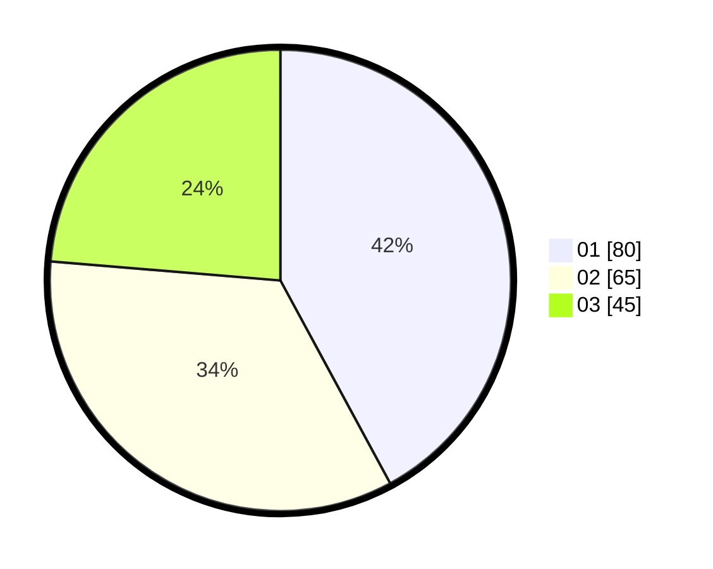

# Hasil

Hasil perolehan suara paslon dapat dilihat pada file paslon-01.txt, paslon-02.txt, dan paslon-03.txt.

Jika tidak ada, artinya data tersebut belum ada pada SIREKAP.

## Perolehan Suara

 * Paslon 01: **80**.
 * Paslon 02: **65**.
 * Paslon 03: **45**.

## Foto C Plano

https://sirekap-obj-formc.kpu.go.id/5820/pemilu/ppwp/31/74/04/10/01/3174041001069-20240215-205636--65e6ea5a-ce59-4df3-a050-5549c83ceabc.jpg

https://sirekap-obj-formc.kpu.go.id/5820/pemilu/ppwp/31/74/04/10/01/3174041001069-20240215-205637--0c6e4ac6-6b4b-4081-92fc-e706410e3e37.jpg

https://sirekap-obj-formc.kpu.go.id/5820/pemilu/ppwp/31/74/04/10/01/3174041001069-20240215-205636--5ac1169a-8028-4d80-9655-f420079e21fa.jpg

## DATA PEMILIH TETAP

Jumlah pemilih dalam DPT: **227**.
 * L: **112**.
 * P: **115**.

## DATA PENGGUNA HAK PILIH

Jumlah pengguna hak pilih dalam DPT: **185**.
 * L: **92**.
 * P: **93**.

Jumlah pengguna hak pilih dalam DPTb: **0**.
 * L: **0**.
 * P: **0**.

Jumlah pengguna hak pilih dalam DPK: **6**.
 * L: **1**.
 * P: **5**.

Jumlah pengguna hak pilih: **191**.
 * L: **93**.
 * P: **98**.

## JUMLAH SUARA SAH DAN TIDAK SAH

JUMLAH SELURUH SUARA SAH: **190**.

JUMLAH SUARA TIDAK SAH: **1**.

JUMLAH SELURUH SUARA SAH DAN SUARA TIDAK SAH: **191**.
