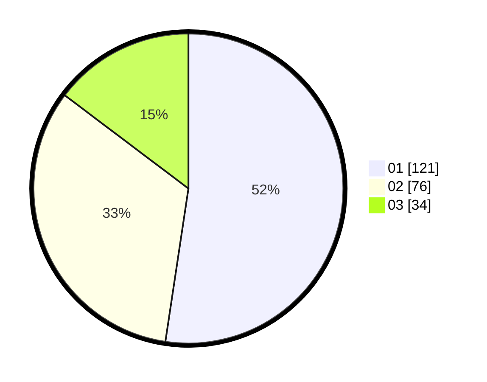

# Hasil

Hasil perolehan suara paslon dapat dilihat pada file paslon-01.txt, paslon-02.txt, dan paslon-03.txt.

Jika tidak ada, artinya data tersebut belum ada pada SIREKAP.

## Perolehan Suara

 * Paslon 01: **121**.
 * Paslon 02: **76**.
 * Paslon 03: **34**.

## Foto C Plano

https://sirekap-obj-formc.kpu.go.id/77cd/pemilu/ppwp/31/74/04/10/01/3174041001083-20240214-225157--1f0c2d9b-9bec-439b-aca2-76068a23f2ee.jpg

https://sirekap-obj-formc.kpu.go.id/77cd/pemilu/ppwp/31/74/04/10/01/3174041001083-20240214-225204--1baeaddf-4189-4061-834a-8ed4557197fd.jpg

https://sirekap-obj-formc.kpu.go.id/77cd/pemilu/ppwp/31/74/04/10/01/3174041001083-20240214-225207--4cd54492-2db6-4c5b-b779-88fb8c1fc407.jpg

## DATA PEMILIH TETAP

Jumlah pemilih dalam DPT: **274**.
 * L: **128**.
 * P: **146**.

## DATA PENGGUNA HAK PILIH

Jumlah pengguna hak pilih dalam DPT: **234**.
 * L: **108**.
 * P: **126**.

Jumlah pengguna hak pilih dalam DPTb: **0**.
 * L: **0**.
 * P: **0**.

Jumlah pengguna hak pilih dalam DPK: **0**.
 * L: **0**.
 * P: **0**.

Jumlah pengguna hak pilih: **234**.
 * L: **108**.
 * P: **126**.

## JUMLAH SUARA SAH DAN TIDAK SAH

JUMLAH SELURUH SUARA SAH: **231**.

JUMLAH SUARA TIDAK SAH: **3**.

JUMLAH SELURUH SUARA SAH DAN SUARA TIDAK SAH: **234**.
