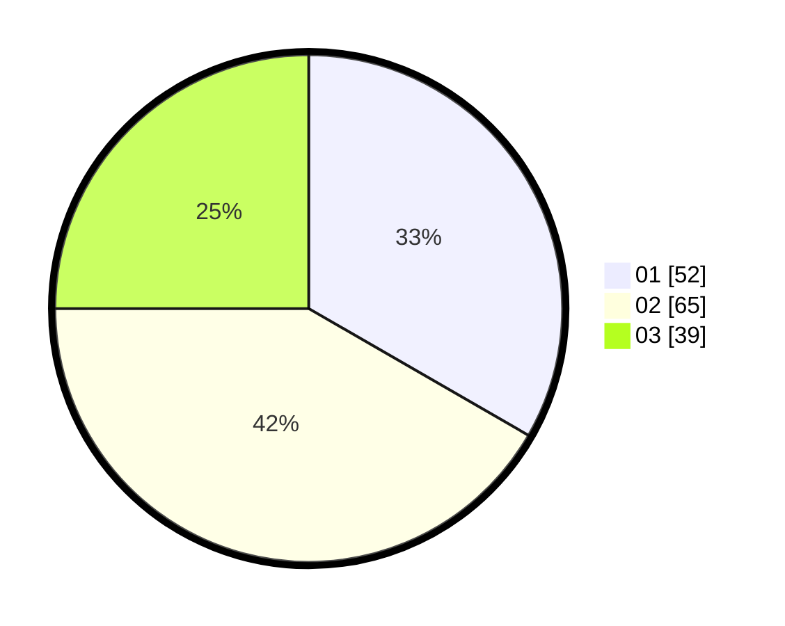

# Hasil

Hasil perolehan suara paslon dapat dilihat pada file paslon-01.txt, paslon-02.txt, dan paslon-03.txt.

Jika tidak ada, artinya data tersebut belum ada pada SIREKAP.

## Perolehan Suara

 * Paslon 01: **52**.
 * Paslon 02: **65**.
 * Paslon 03: **39**.

## Foto C Plano

https://sirekap-obj-formc.kpu.go.id/56c9/pemilu/ppwp/31/74/04/10/01/3174041001085-20240214-184731--fac961df-f863-45a2-8275-f981fab07e6f.jpg

https://sirekap-obj-formc.kpu.go.id/56c9/pemilu/ppwp/31/74/04/10/01/3174041001085-20240214-184735--ed477803-80ca-49e9-81e0-5dc58c1d2c78.jpg

https://sirekap-obj-formc.kpu.go.id/56c9/pemilu/ppwp/31/74/04/10/01/3174041001085-20240214-184739--27dccdd9-5a82-4838-8378-81a81ba55d9a.jpg

## DATA PEMILIH TETAP

Jumlah pemilih dalam DPT: **201**.
 * L: **94**.
 * P: **107**.

## DATA PENGGUNA HAK PILIH

Jumlah pengguna hak pilih dalam DPT: **154**.
 * L: **70**.
 * P: **84**.

Jumlah pengguna hak pilih dalam DPTb: **4**.
 * L: **1**.
 * P: **3**.

Jumlah pengguna hak pilih dalam DPK: **0**.
 * L: **0**.
 * P: **0**.

Jumlah pengguna hak pilih: **158**.
 * L: **71**.
 * P: **87**.

## JUMLAH SUARA SAH DAN TIDAK SAH

JUMLAH SELURUH SUARA SAH: **156**.

JUMLAH SUARA TIDAK SAH: **2**.

JUMLAH SELURUH SUARA SAH DAN SUARA TIDAK SAH: **158**.
