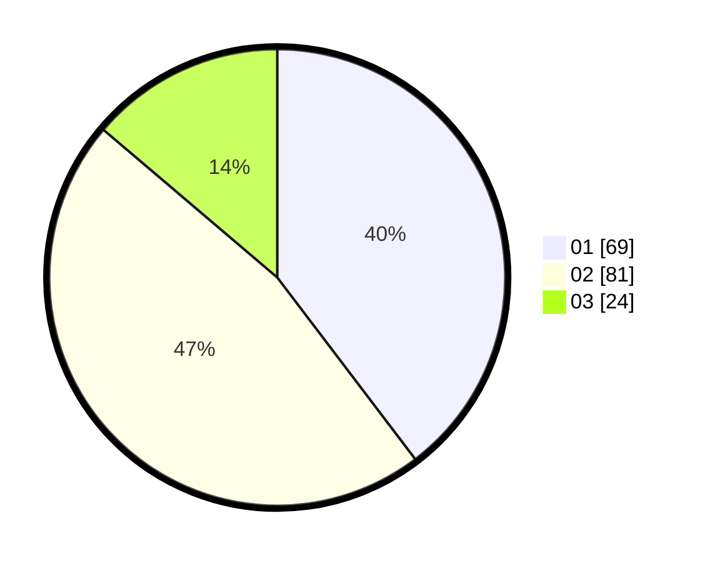

# Hasil

Hasil perolehan suara paslon dapat dilihat pada file paslon-01.txt, paslon-02.txt, dan paslon-03.txt.

Jika tidak ada, artinya data tersebut belum ada pada SIREKAP.

## Perolehan Suara

 * Paslon 01: **69**.
 * Paslon 02: **81**.
 * Paslon 03: **24**.

## Foto C Plano

https://sirekap-obj-formc.kpu.go.id/acaf/pemilu/ppwp/31/74/04/10/01/3174041001088-20240214-155657--593486cb-2dc4-492b-86af-d96d3524b47c.jpg

https://sirekap-obj-formc.kpu.go.id/acaf/pemilu/ppwp/31/74/04/10/01/3174041001088-20240214-160117--f62b2489-ee0e-481c-9739-9fca11899db1.jpg

https://sirekap-obj-formc.kpu.go.id/acaf/pemilu/ppwp/31/74/04/10/01/3174041001088-20240214-191656--2eef803e-2931-49e6-82cc-681e9f01edf0.jpg

## DATA PEMILIH TETAP

Jumlah pemilih dalam DPT: **211**.
 * L: **112**.
 * P: **99**.

## DATA PENGGUNA HAK PILIH

Jumlah pengguna hak pilih dalam DPT: **172**.
 * L: **92**.
 * P: **80**.

Jumlah pengguna hak pilih dalam DPTb: **5**.
 * L: **2**.
 * P: **3**.

Jumlah pengguna hak pilih dalam DPK: **1**.
 * L: **0**.
 * P: **1**.

Jumlah pengguna hak pilih: **178**.
 * L: **94**.
 * P: **84**.

## JUMLAH SUARA SAH DAN TIDAK SAH

JUMLAH SELURUH SUARA SAH: **174**.

JUMLAH SUARA TIDAK SAH: **4**.

JUMLAH SELURUH SUARA SAH DAN SUARA TIDAK SAH: **178**.
