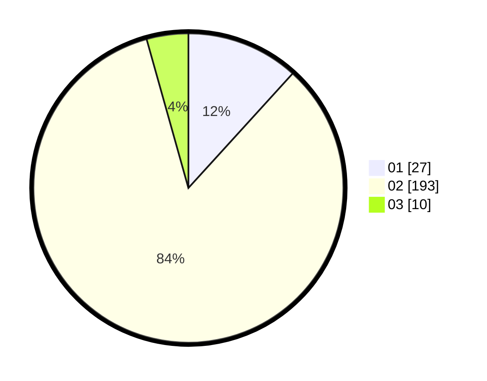

# Hasil

Hasil perolehan suara paslon dapat dilihat pada file paslon-01.txt, paslon-02.txt, dan paslon-03.txt.

Jika tidak ada, artinya data tersebut belum ada pada SIREKAP.

## Perolehan Suara

 * Paslon 01: **27**.
 * Paslon 02: **193**.
 * Paslon 03: **10**.

## Foto C Plano

https://sirekap-obj-formc.kpu.go.id/8515/pemilu/ppwp/31/74/04/10/01/3174041001901-20240214-190709--edac2eb8-cb50-4bdb-8efd-10031da318f0.jpg

https://sirekap-obj-formc.kpu.go.id/8515/pemilu/ppwp/31/74/04/10/01/3174041001901-20240214-203452--180f2dc5-e8f9-4784-83d8-97c1f866b42f.jpg

https://sirekap-obj-formc.kpu.go.id/8515/pemilu/ppwp/31/74/04/10/01/3174041001901-20240214-185732--1f2616f2-922b-4011-a7dc-7b2134e7f029.jpg

## DATA PEMILIH TETAP

Jumlah pemilih dalam DPT: **262**.
 * L: **262**.
 * P: **0**.

## DATA PENGGUNA HAK PILIH

Jumlah pengguna hak pilih dalam DPT: **0**.
 * L: **0**.
 * P: **0**.

Jumlah pengguna hak pilih dalam DPTb: **233**.
 * L: **233**.
 * P: **0**.

Jumlah pengguna hak pilih dalam DPK: **0**.
 * L: **0**.
 * P: **0**.

Jumlah pengguna hak pilih: **233**.
 * L: **233**.
 * P: **0**.

## JUMLAH SUARA SAH DAN TIDAK SAH

JUMLAH SELURUH SUARA SAH: **230**.

JUMLAH SUARA TIDAK SAH: **3**.

JUMLAH SELURUH SUARA SAH DAN SUARA TIDAK SAH: **233**.
