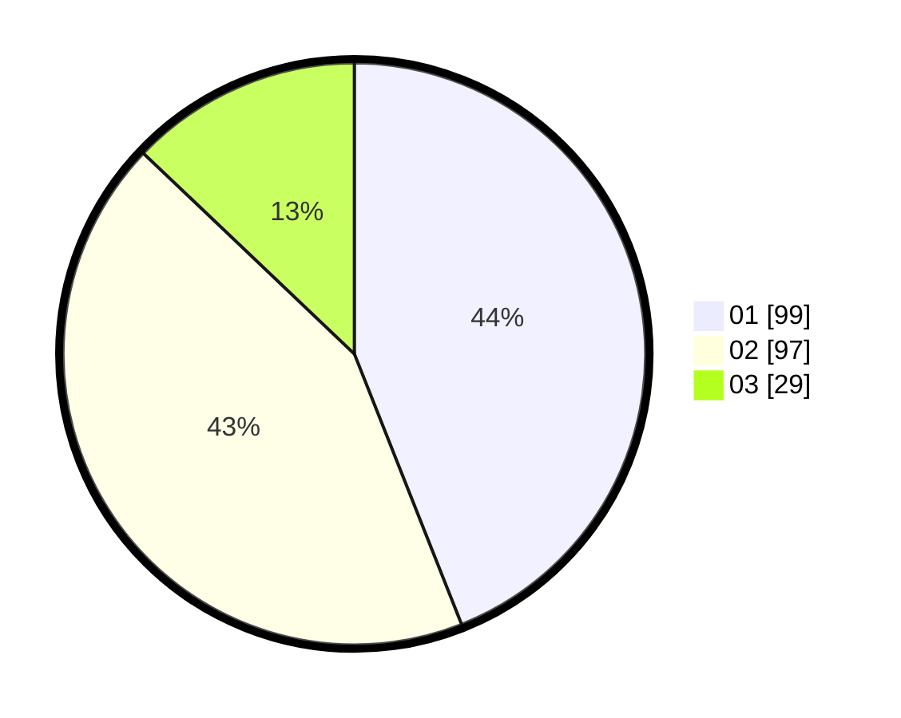

# Hasil

Hasil perolehan suara paslon dapat dilihat pada file paslon-01.txt, paslon-02.txt, dan paslon-03.txt.

Jika tidak ada, artinya data tersebut belum ada pada SIREKAP.

## Perolehan Suara

 * Paslon 01: **99**.
 * Paslon 02: **97**.
 * Paslon 03: **29**.

## Foto C Plano

https://sirekap-obj-formc.kpu.go.id/d6ab/pemilu/ppwp/31/74/04/10/02/3174041002012-20240216-080133--783c59ca-060a-46a9-8fc8-e8aec110fd85.jpg

https://sirekap-obj-formc.kpu.go.id/d6ab/pemilu/ppwp/31/74/04/10/02/3174041002012-20240216-093307--f77e25b0-083f-47fe-819e-609be2addb10.jpg

https://sirekap-obj-formc.kpu.go.id/d6ab/pemilu/ppwp/31/74/04/10/02/3174041002012-20240216-080140--77131a58-e463-4e1c-9744-04b3443177a5.jpg

## DATA PEMILIH TETAP

Jumlah pemilih dalam DPT: **274**.
 * L: **135**.
 * P: **139**.

## DATA PENGGUNA HAK PILIH

Jumlah pengguna hak pilih dalam DPT: **215**.
 * L: **106**.
 * P: **109**.

Jumlah pengguna hak pilih dalam DPTb: **13**.
 * L: **4**.
 * P: **9**.

Jumlah pengguna hak pilih dalam DPK: **4**.
 * L: **1**.
 * P: **3**.

Jumlah pengguna hak pilih: **232**.
 * L: **111**.
 * P: **121**.

## JUMLAH SUARA SAH DAN TIDAK SAH

JUMLAH SELURUH SUARA SAH: **225**.

JUMLAH SUARA TIDAK SAH: **7**.

JUMLAH SELURUH SUARA SAH DAN SUARA TIDAK SAH: **232**.
