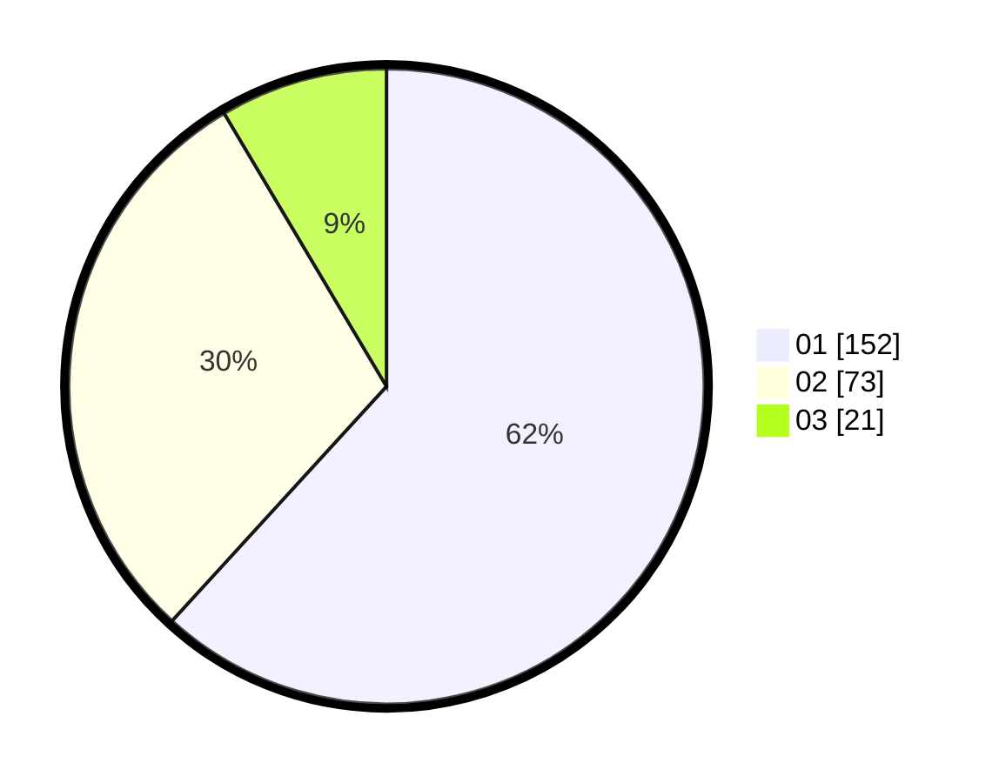

# Hasil

Hasil perolehan suara paslon dapat dilihat pada file paslon-01.txt, paslon-02.txt, dan paslon-03.txt.

Jika tidak ada, artinya data tersebut belum ada pada SIREKAP.

## Perolehan Suara

 * Paslon 01: **152**.
 * Paslon 02: **73**.
 * Paslon 03: **21**.

## Foto C Plano

https://sirekap-obj-formc.kpu.go.id/d24c/pemilu/ppwp/31/74/04/10/02/3174041002018-20240216-105249--1f2a4c3b-d9ab-447f-88f6-3d27de11cc7c.jpg

https://sirekap-obj-formc.kpu.go.id/d24c/pemilu/ppwp/31/74/04/10/02/3174041002018-20240216-105333--e68770cb-1816-485a-99b4-2c04c155644a.jpg

https://sirekap-obj-formc.kpu.go.id/d24c/pemilu/ppwp/31/74/04/10/02/3174041002018-20240216-105444--9614219d-2f1d-458e-8e10-53509e2fa553.jpg

## DATA PEMILIH TETAP

Jumlah pemilih dalam DPT: **265**.
 * L: **128**.
 * P: **137**.

## DATA PENGGUNA HAK PILIH

Jumlah pengguna hak pilih dalam DPT: **232**.
 * L: **112**.
 * P: **120**.

Jumlah pengguna hak pilih dalam DPTb: **16**.
 * L: **7**.
 * P: **9**.

Jumlah pengguna hak pilih dalam DPK: **0**.
 * L: **0**.
 * P: **0**.

Jumlah pengguna hak pilih: **248**.
 * L: **119**.
 * P: **129**.

## JUMLAH SUARA SAH DAN TIDAK SAH

JUMLAH SELURUH SUARA SAH: **246**.

JUMLAH SUARA TIDAK SAH: **2**.

JUMLAH SELURUH SUARA SAH DAN SUARA TIDAK SAH: **248**.
