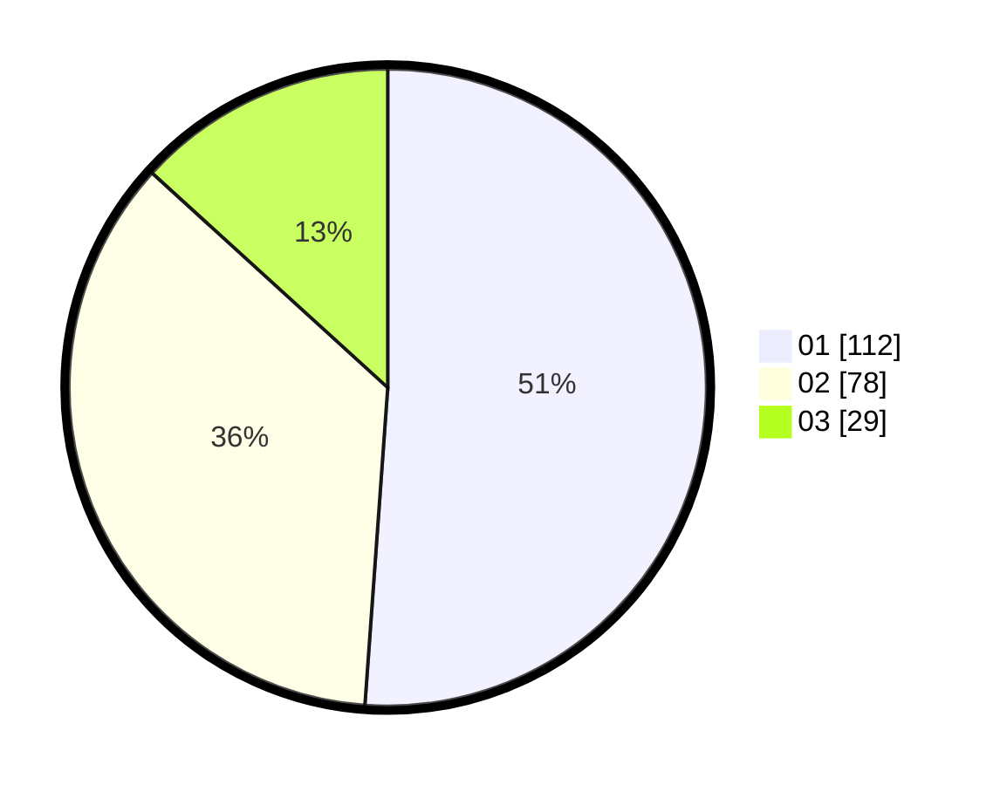

# Hasil

Hasil perolehan suara paslon dapat dilihat pada file paslon-01.txt, paslon-02.txt, dan paslon-03.txt.

Jika tidak ada, artinya data tersebut belum ada pada SIREKAP.

## Perolehan Suara

 * Paslon 01: **112**.
 * Paslon 02: **78**.
 * Paslon 03: **29**.

## Foto C Plano

https://sirekap-obj-formc.kpu.go.id/7cee/pemilu/ppwp/31/74/04/10/02/3174041002026-20240215-225436--142a2a91-a5dd-404a-8d33-669461a568ef.jpg

https://sirekap-obj-formc.kpu.go.id/7cee/pemilu/ppwp/31/74/04/10/02/3174041002026-20240215-225439--34753470-d0dd-4e70-b5d3-9febc32fb905.jpg

https://sirekap-obj-formc.kpu.go.id/7cee/pemilu/ppwp/31/74/04/10/02/3174041002026-20240215-225437--fd4cf980-b612-4495-8f8a-e50fbb13dab1.jpg

## DATA PEMILIH TETAP

Jumlah pemilih dalam DPT: **267**.
 * L: **125**.
 * P: **142**.

## DATA PENGGUNA HAK PILIH

Jumlah pengguna hak pilih dalam DPT: **213**.
 * L: **100**.
 * P: **113**.

Jumlah pengguna hak pilih dalam DPTb: **8**.
 * L: **1**.
 * P: **7**.

Jumlah pengguna hak pilih dalam DPK: **2**.
 * L: **1**.
 * P: **1**.

Jumlah pengguna hak pilih: **223**.
 * L: **102**.
 * P: **121**.

## JUMLAH SUARA SAH DAN TIDAK SAH

JUMLAH SELURUH SUARA SAH: **219**.

JUMLAH SUARA TIDAK SAH: **5**.

JUMLAH SELURUH SUARA SAH DAN SUARA TIDAK SAH: **224**.
