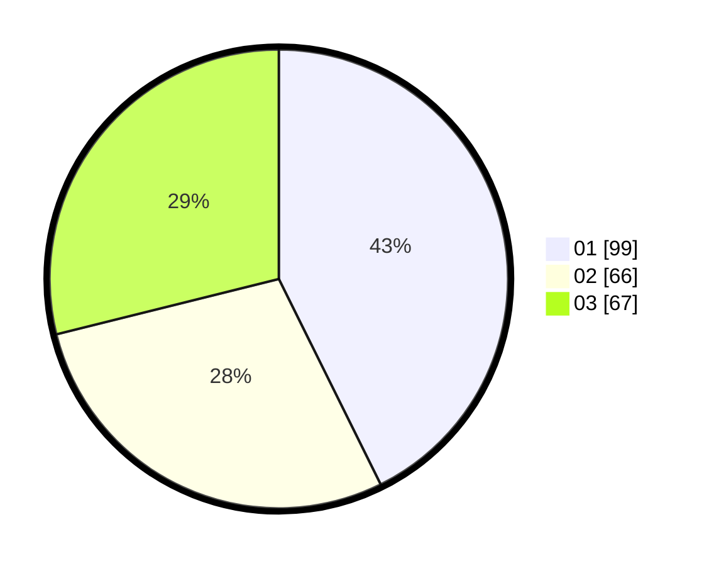

# Hasil

Hasil perolehan suara paslon dapat dilihat pada file paslon-01.txt, paslon-02.txt, dan paslon-03.txt.

Jika tidak ada, artinya data tersebut belum ada pada SIREKAP.

## Perolehan Suara

 * Paslon 01: **99**.
 * Paslon 02: **66**.
 * Paslon 03: **67**.

## Foto C Plano

https://sirekap-obj-formc.kpu.go.id/1d94/pemilu/ppwp/31/74/04/10/02/3174041002028-20240214-201228--d3e78a52-4020-4092-9bd6-eb82ea6b7f22.jpg

https://sirekap-obj-formc.kpu.go.id/1d94/pemilu/ppwp/31/74/04/10/02/3174041002028-20240214-201250--d0f919fc-d010-452b-a713-79d3d8eb576a.jpg

https://sirekap-obj-formc.kpu.go.id/1d94/pemilu/ppwp/31/74/04/10/02/3174041002028-20240214-201310--9f5705f3-3639-46fb-b2cc-309df4ea199c.jpg

## DATA PEMILIH TETAP

Jumlah pemilih dalam DPT: **265**.
 * L: **119**.
 * P: **146**.

## DATA PENGGUNA HAK PILIH

Jumlah pengguna hak pilih dalam DPT: **210**.
 * L: **97**.
 * P: **113**.

Jumlah pengguna hak pilih dalam DPTb: **26**.
 * L: **11**.
 * P: **15**.

Jumlah pengguna hak pilih dalam DPK: **1**.
 * L: **0**.
 * P: **1**.

Jumlah pengguna hak pilih: **237**.
 * L: **108**.
 * P: **129**.

## JUMLAH SUARA SAH DAN TIDAK SAH

JUMLAH SELURUH SUARA SAH: **232**.

JUMLAH SUARA TIDAK SAH: **5**.

JUMLAH SELURUH SUARA SAH DAN SUARA TIDAK SAH: **237**.
