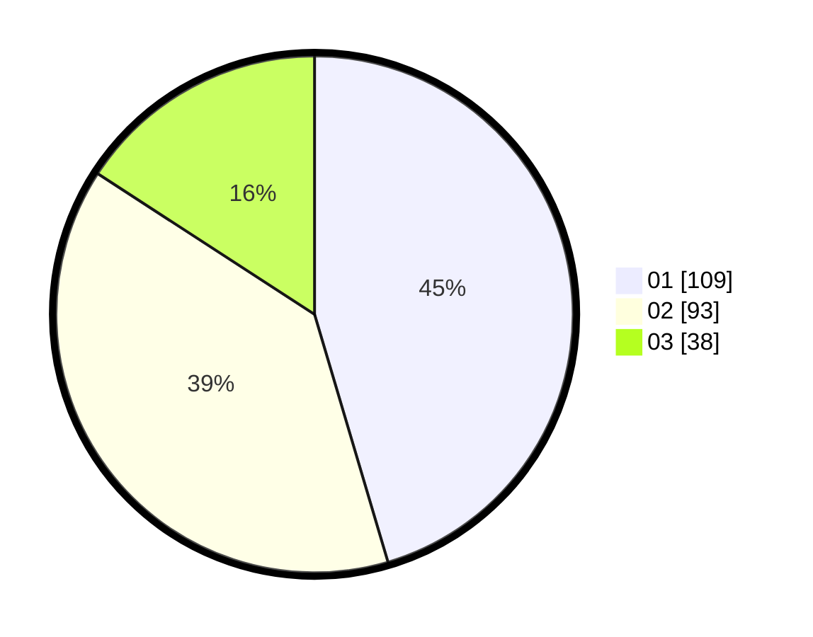

# Hasil

Hasil perolehan suara paslon dapat dilihat pada file paslon-01.txt, paslon-02.txt, dan paslon-03.txt.

Jika tidak ada, artinya data tersebut belum ada pada SIREKAP.

## Perolehan Suara

 * Paslon 01: **109**.
 * Paslon 02: **93**.
 * Paslon 03: **38**.

## Foto C Plano

https://sirekap-obj-formc.kpu.go.id/e5be/pemilu/ppwp/31/74/04/10/02/3174041002031-20240216-025759--d9520611-3b08-4b66-b1e4-51abf2be3e83.jpg

https://sirekap-obj-formc.kpu.go.id/e5be/pemilu/ppwp/31/74/04/10/02/3174041002031-20240216-025812--999ac548-08c1-47e1-9d7f-80dcf857515b.jpg

https://sirekap-obj-formc.kpu.go.id/e5be/pemilu/ppwp/31/74/04/10/02/3174041002031-20240216-025808--b90e275c-f76b-4968-9f10-1e5c738976d9.jpg

## DATA PEMILIH TETAP

Jumlah pemilih dalam DPT: **264**.
 * L: **117**.
 * P: **147**.

## DATA PENGGUNA HAK PILIH

Jumlah pengguna hak pilih dalam DPT: **226**.
 * L: **98**.
 * P: **128**.

Jumlah pengguna hak pilih dalam DPTb: **13**.
 * L: **3**.
 * P: **10**.

Jumlah pengguna hak pilih dalam DPK: **4**.
 * L: **1**.
 * P: **3**.

Jumlah pengguna hak pilih: **243**.
 * L: **102**.
 * P: **141**.

## JUMLAH SUARA SAH DAN TIDAK SAH

JUMLAH SELURUH SUARA SAH: **240**.

JUMLAH SUARA TIDAK SAH: **3**.

JUMLAH SELURUH SUARA SAH DAN SUARA TIDAK SAH: **243**.
