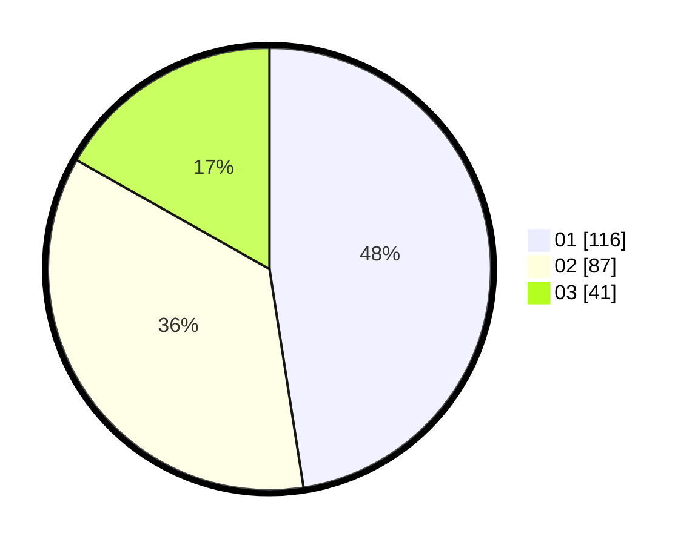

# Hasil

Hasil perolehan suara paslon dapat dilihat pada file paslon-01.txt, paslon-02.txt, dan paslon-03.txt.

Jika tidak ada, artinya data tersebut belum ada pada SIREKAP.

## Perolehan Suara

 * Paslon 01: **116**.
 * Paslon 02: **87**.
 * Paslon 03: **41**.

## Foto C Plano

https://sirekap-obj-formc.kpu.go.id/d23a/pemilu/ppwp/31/74/04/10/02/3174041002033-20240214-210831--fc955e5e-636b-42fa-9fe5-7f6666494108.jpg

https://sirekap-obj-formc.kpu.go.id/d23a/pemilu/ppwp/31/74/04/10/02/3174041002033-20240214-155408--408b7363-12d1-4d00-abbc-c83d8bed6c0b.jpg

https://sirekap-obj-formc.kpu.go.id/d23a/pemilu/ppwp/31/74/04/10/02/3174041002033-20240214-155213--7d0b6be7-624a-4a84-9c78-da979d29530a.jpg

## DATA PEMILIH TETAP

Jumlah pemilih dalam DPT: **271**.
 * L: **130**.
 * P: **141**.

## DATA PENGGUNA HAK PILIH

Jumlah pengguna hak pilih dalam DPT: **219**.
 * L: **99**.
 * P: **120**.

Jumlah pengguna hak pilih dalam DPTb: **19**.
 * L: **3**.
 * P: **16**.

Jumlah pengguna hak pilih dalam DPK: **8**.
 * L: **4**.
 * P: **4**.

Jumlah pengguna hak pilih: **246**.
 * L: **106**.
 * P: **140**.

## JUMLAH SUARA SAH DAN TIDAK SAH

JUMLAH SELURUH SUARA SAH: **244**.

JUMLAH SUARA TIDAK SAH: **2**.

JUMLAH SELURUH SUARA SAH DAN SUARA TIDAK SAH: **246**.
