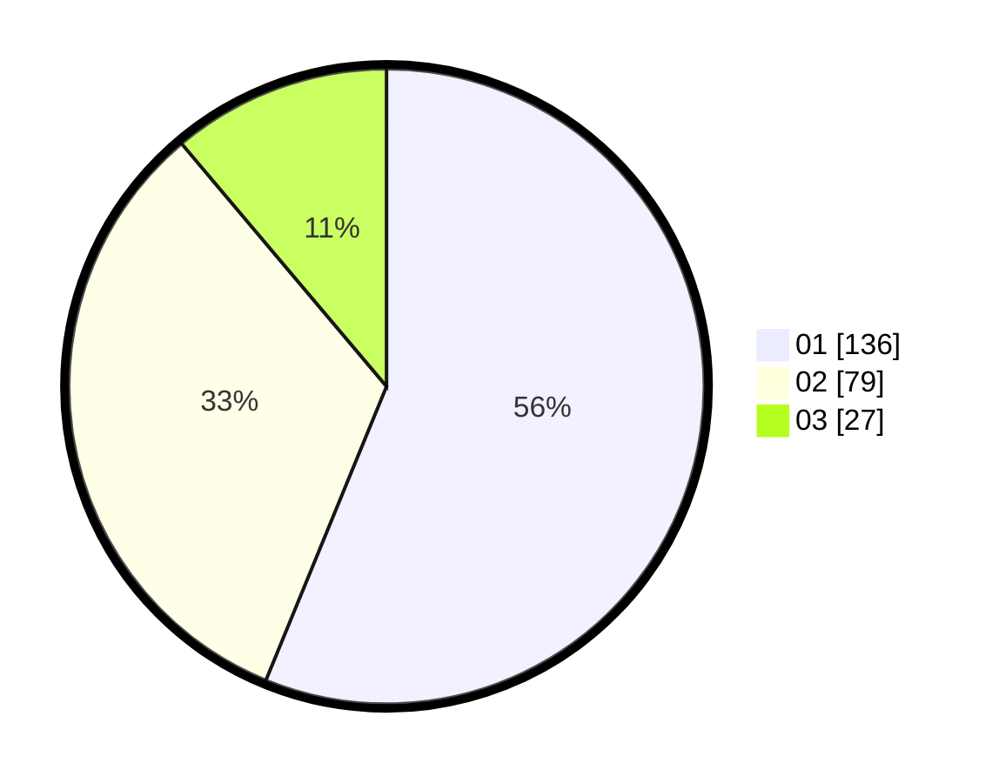

# Hasil

Hasil perolehan suara paslon dapat dilihat pada file paslon-01.txt, paslon-02.txt, dan paslon-03.txt.

Jika tidak ada, artinya data tersebut belum ada pada SIREKAP.

## Perolehan Suara

 * Paslon 01: **136**.
 * Paslon 02: **79**.
 * Paslon 03: **27**.

## Foto C Plano

https://sirekap-obj-formc.kpu.go.id/3c6c/pemilu/ppwp/31/74/04/10/02/3174041002035-20240214-155158--14915ff3-c6d8-4358-b78b-bdd4b04d3310.jpg

https://sirekap-obj-formc.kpu.go.id/3c6c/pemilu/ppwp/31/74/04/10/02/3174041002035-20240214-155440--907496db-7fab-43b5-8c25-f7613c2c816c.jpg

https://sirekap-obj-formc.kpu.go.id/3c6c/pemilu/ppwp/31/74/04/10/02/3174041002035-20240214-155636--b79f3c9b-865e-427f-8e84-dbf8c024a505.jpg

## DATA PEMILIH TETAP

Jumlah pemilih dalam DPT: **269**.
 * L: **126**.
 * P: **143**.

## DATA PENGGUNA HAK PILIH

Jumlah pengguna hak pilih dalam DPT: **228**.
 * L: **104**.
 * P: **124**.

Jumlah pengguna hak pilih dalam DPTb: **15**.
 * L: **4**.
 * P: **11**.

Jumlah pengguna hak pilih dalam DPK: **1**.
 * L: **1**.
 * P: **0**.

Jumlah pengguna hak pilih: **244**.
 * L: **109**.
 * P: **135**.

## JUMLAH SUARA SAH DAN TIDAK SAH

JUMLAH SELURUH SUARA SAH: **242**.

JUMLAH SUARA TIDAK SAH: **2**.

JUMLAH SELURUH SUARA SAH DAN SUARA TIDAK SAH: **244**.
