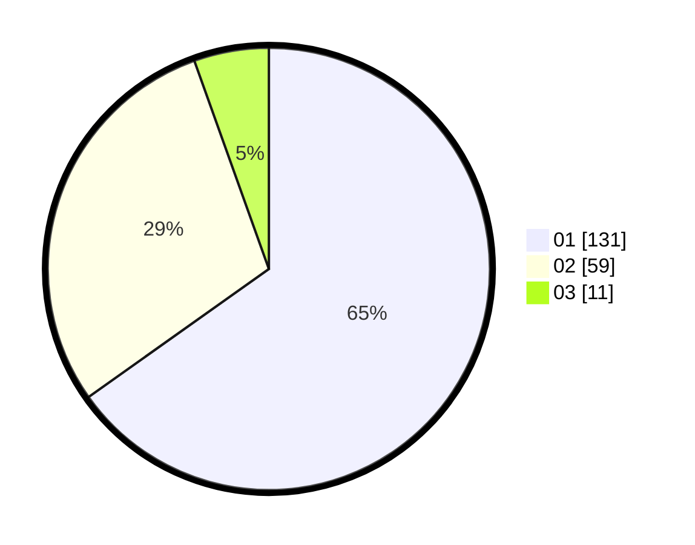

# Hasil

Hasil perolehan suara paslon dapat dilihat pada file paslon-01.txt, paslon-02.txt, dan paslon-03.txt.

Jika tidak ada, artinya data tersebut belum ada pada SIREKAP.

## Perolehan Suara

 * Paslon 01: **131**.
 * Paslon 02: **59**.
 * Paslon 03: **11**.

## Foto C Plano

https://sirekap-obj-formc.kpu.go.id/eac6/pemilu/ppwp/31/74/04/10/02/3174041002041-20240215-013340--24d9447a-c87a-40de-bab7-964e2f21b4e3.jpg

https://sirekap-obj-formc.kpu.go.id/eac6/pemilu/ppwp/31/74/04/10/02/3174041002041-20240214-221435--0ed6c725-aee2-4432-b0ba-39813c0a7b39.jpg

https://sirekap-obj-formc.kpu.go.id/eac6/pemilu/ppwp/31/74/04/10/02/3174041002041-20240215-013325--0f0733ba-7dec-4ba6-b10a-c7159cd85261.jpg
