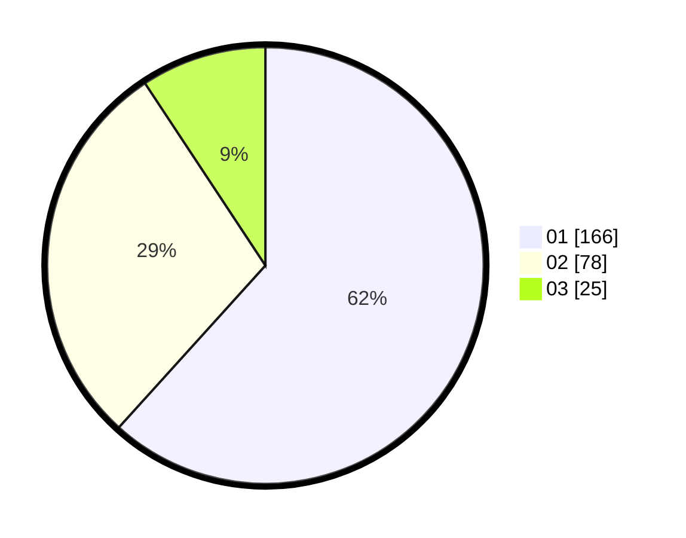

# Hasil

Hasil perolehan suara paslon dapat dilihat pada file paslon-01.txt, paslon-02.txt, dan paslon-03.txt.

Jika tidak ada, artinya data tersebut belum ada pada SIREKAP.

## Perolehan Suara

 * Paslon 01: **166**.
 * Paslon 02: **78**.
 * Paslon 03: **25**.

## Foto C Plano

https://sirekap-obj-formc.kpu.go.id/649c/pemilu/ppwp/31/74/04/10/02/3174041002043-20240216-042547--248ea143-8cd6-49d8-a2fe-a3dd20669f33.jpg

https://sirekap-obj-formc.kpu.go.id/649c/pemilu/ppwp/31/74/04/10/02/3174041002043-20240216-042549--dccbc51b-3aaf-4fd2-b252-820374082d8d.jpg

https://sirekap-obj-formc.kpu.go.id/649c/pemilu/ppwp/31/74/04/10/02/3174041002043-20240216-042548--48f789fe-d772-42a5-9b0a-6887e3f12bba.jpg

## DATA PEMILIH TETAP

Jumlah pemilih dalam DPT: **285**.
 * L: **133**.
 * P: **152**.

## DATA PENGGUNA HAK PILIH

Jumlah pengguna hak pilih dalam DPT: **256**.
 * L: **118**.
 * P: **138**.

Jumlah pengguna hak pilih dalam DPTb: **10**.
 * L: **2**.
 * P: **2**.

Jumlah pengguna hak pilih dalam DPK: **4**.
 * L: **2**.
 * P: **2**.

Jumlah pengguna hak pilih: **270**.
 * L: **122**.
 * P: **148**.

## JUMLAH SUARA SAH DAN TIDAK SAH

JUMLAH SELURUH SUARA SAH: **269**.

JUMLAH SUARA TIDAK SAH: **1**.

JUMLAH SELURUH SUARA SAH DAN SUARA TIDAK SAH: **270**.
