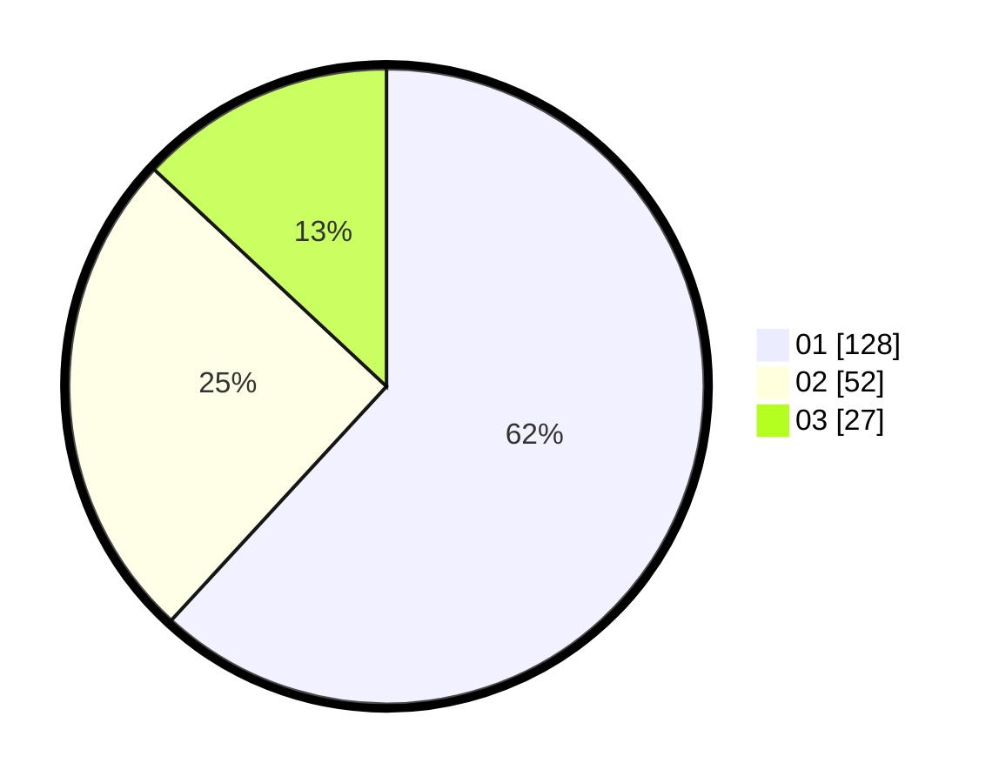

# Hasil

Hasil perolehan suara paslon dapat dilihat pada file paslon-01.txt, paslon-02.txt, dan paslon-03.txt.

Jika tidak ada, artinya data tersebut belum ada pada SIREKAP.

## Perolehan Suara

 * Paslon 01: **128**.
 * Paslon 02: **52**.
 * Paslon 03: **27**.

## Foto C Plano

https://sirekap-obj-formc.kpu.go.id/4910/pemilu/ppwp/31/74/04/10/02/3174041002044-20240216-101410--446dec21-b43c-400c-b275-980d293cbfa6.jpg

https://sirekap-obj-formc.kpu.go.id/4910/pemilu/ppwp/31/74/04/10/02/3174041002044-20240215-001956--832e13e8-9e9e-45b8-ab66-96327032d1f5.jpg

https://sirekap-obj-formc.kpu.go.id/4910/pemilu/ppwp/31/74/04/10/02/3174041002044-20240215-002113--d22105f4-f09b-45e0-9da3-c6d7c17fd453.jpg

## DATA PEMILIH TETAP

Jumlah pemilih dalam DPT: **248**.
 * L: **128**.
 * P: **120**.

## DATA PENGGUNA HAK PILIH

Jumlah pengguna hak pilih dalam DPT: **201**.
 * L: **106**.
 * P: **95**.

Jumlah pengguna hak pilih dalam DPTb: **7**.
 * L: **0**.
 * P: **7**.

Jumlah pengguna hak pilih dalam DPK: **1**.
 * L: **0**.
 * P: **1**.

Jumlah pengguna hak pilih: **209**.
 * L: **106**.
 * P: **103**.

## JUMLAH SUARA SAH DAN TIDAK SAH

JUMLAH SELURUH SUARA SAH: **207**.

JUMLAH SUARA TIDAK SAH: **2**.

JUMLAH SELURUH SUARA SAH DAN SUARA TIDAK SAH: **209**.
