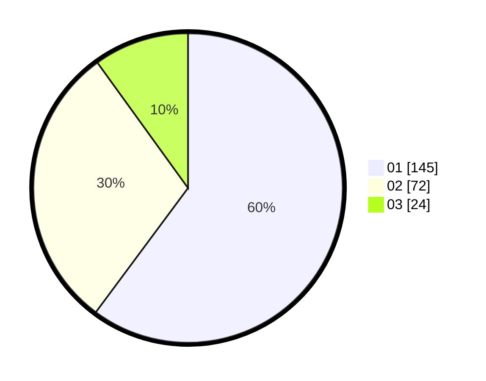

# Hasil

Hasil perolehan suara paslon dapat dilihat pada file paslon-01.txt, paslon-02.txt, dan paslon-03.txt.

Jika tidak ada, artinya data tersebut belum ada pada SIREKAP.

## Perolehan Suara

 * Paslon 01: **145**.
 * Paslon 02: **72**.
 * Paslon 03: **24**.

## Foto C Plano

https://sirekap-obj-formc.kpu.go.id/9425/pemilu/ppwp/31/74/04/10/02/3174041002067-20240215-220035--5bc3cf0f-2879-492f-bb6c-8e3e5cdb9fe9.jpg

https://sirekap-obj-formc.kpu.go.id/9425/pemilu/ppwp/31/74/04/10/02/3174041002067-20240215-220039--cec50238-4173-405e-a50b-dcf85e54003c.jpg

https://sirekap-obj-formc.kpu.go.id/9425/pemilu/ppwp/31/74/04/10/02/3174041002067-20240215-220037--d68d6776-4302-4689-83ca-9a5780c3be81.jpg

## DATA PEMILIH TETAP

Jumlah pemilih dalam DPT: **276**.
 * L: **130**.
 * P: **146**.

## DATA PENGGUNA HAK PILIH

Jumlah pengguna hak pilih dalam DPT: **229**.
 * L: **107**.
 * P: **122**.

Jumlah pengguna hak pilih dalam DPTb: **5**.
 * L: **2**.
 * P: **3**.

Jumlah pengguna hak pilih dalam DPK: **9**.
 * L: **3**.
 * P: **6**.

Jumlah pengguna hak pilih: **243**.
 * L: **112**.
 * P: **131**.

## JUMLAH SUARA SAH DAN TIDAK SAH

JUMLAH SELURUH SUARA SAH: **241**.

JUMLAH SUARA TIDAK SAH: **2**.

JUMLAH SELURUH SUARA SAH DAN SUARA TIDAK SAH: **243**.
