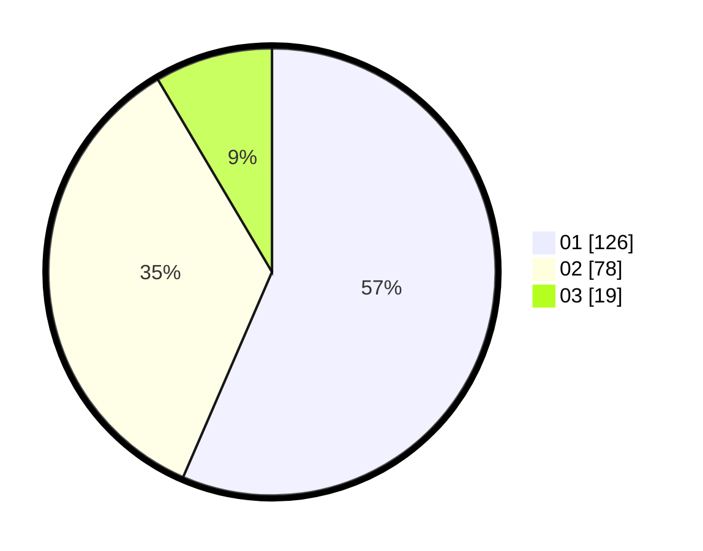

# Hasil

Hasil perolehan suara paslon dapat dilihat pada file paslon-01.txt, paslon-02.txt, dan paslon-03.txt.

Jika tidak ada, artinya data tersebut belum ada pada SIREKAP.

## Perolehan Suara

 * Paslon 01: **126**.
 * Paslon 02: **78**.
 * Paslon 03: **19**.

## Foto C Plano

https://sirekap-obj-formc.kpu.go.id/7bb1/pemilu/ppwp/31/74/04/10/02/3174041002072-20240214-191244--7eb5d94d-c7eb-47d3-bdf8-4301ea22b734.jpg

https://sirekap-obj-formc.kpu.go.id/7bb1/pemilu/ppwp/31/74/04/10/02/3174041002072-20240214-191434--c44551e0-026d-43ff-8b8b-53e88a2ef6f4.jpg

https://sirekap-obj-formc.kpu.go.id/7bb1/pemilu/ppwp/31/74/04/10/02/3174041002072-20240214-191618--04184e7a-5913-456c-a4ce-f9133d029936.jpg

## DATA PEMILIH TETAP

Jumlah pemilih dalam DPT: **282**.
 * L: **142**.
 * P: **140**.

## DATA PENGGUNA HAK PILIH

Jumlah pengguna hak pilih dalam DPT: **214**.
 * L: **99**.
 * P: **115**.

Jumlah pengguna hak pilih dalam DPTb: **11**.
 * L: **3**.
 * P: **8**.

Jumlah pengguna hak pilih dalam DPK: **1**.
 * L: **0**.
 * P: **1**.

Jumlah pengguna hak pilih: **226**.
 * L: **102**.
 * P: **124**.

## JUMLAH SUARA SAH DAN TIDAK SAH

JUMLAH SELURUH SUARA SAH: **223**.

JUMLAH SUARA TIDAK SAH: **3**.

JUMLAH SELURUH SUARA SAH DAN SUARA TIDAK SAH: **226**.
