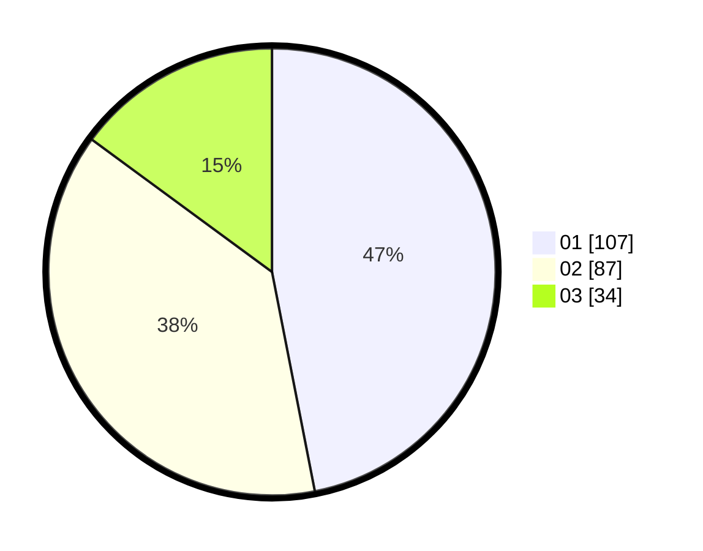

# Hasil

Hasil perolehan suara paslon dapat dilihat pada file paslon-01.txt, paslon-02.txt, dan paslon-03.txt.

Jika tidak ada, artinya data tersebut belum ada pada SIREKAP.

## Perolehan Suara

 * Paslon 01: **107**.
 * Paslon 02: **87**.
 * Paslon 03: **34**.

## Foto C Plano

https://sirekap-obj-formc.kpu.go.id/09d5/pemilu/ppwp/31/74/04/10/02/3174041002080-20240215-211430--89ebbf25-d5ba-4e9d-b4e0-139f09a2a2af.jpg

https://sirekap-obj-formc.kpu.go.id/09d5/pemilu/ppwp/31/74/04/10/02/3174041002080-20240215-211433--47875b3b-b1b5-4b42-b503-c4502f273200.jpg

https://sirekap-obj-formc.kpu.go.id/09d5/pemilu/ppwp/31/74/04/10/02/3174041002080-20240215-211431--9e94e328-e769-4da5-994c-a318f4432533.jpg

## DATA PEMILIH TETAP

Jumlah pemilih dalam DPT: **276**.
 * L: **144**.
 * P: **132**.

## DATA PENGGUNA HAK PILIH

Jumlah pengguna hak pilih dalam DPT: **229**.
 * L: **112**.
 * P: **117**.

Jumlah pengguna hak pilih dalam DPTb: **3**.
 * L: **1**.
 * P: **2**.

Jumlah pengguna hak pilih dalam DPK: **2**.
 * L: **0**.
 * P: **2**.

Jumlah pengguna hak pilih: **234**.
 * L: **113**.
 * P: **121**.

## JUMLAH SUARA SAH DAN TIDAK SAH

JUMLAH SELURUH SUARA SAH: **228**.

JUMLAH SUARA TIDAK SAH: **6**.

JUMLAH SELURUH SUARA SAH DAN SUARA TIDAK SAH: **234**.
