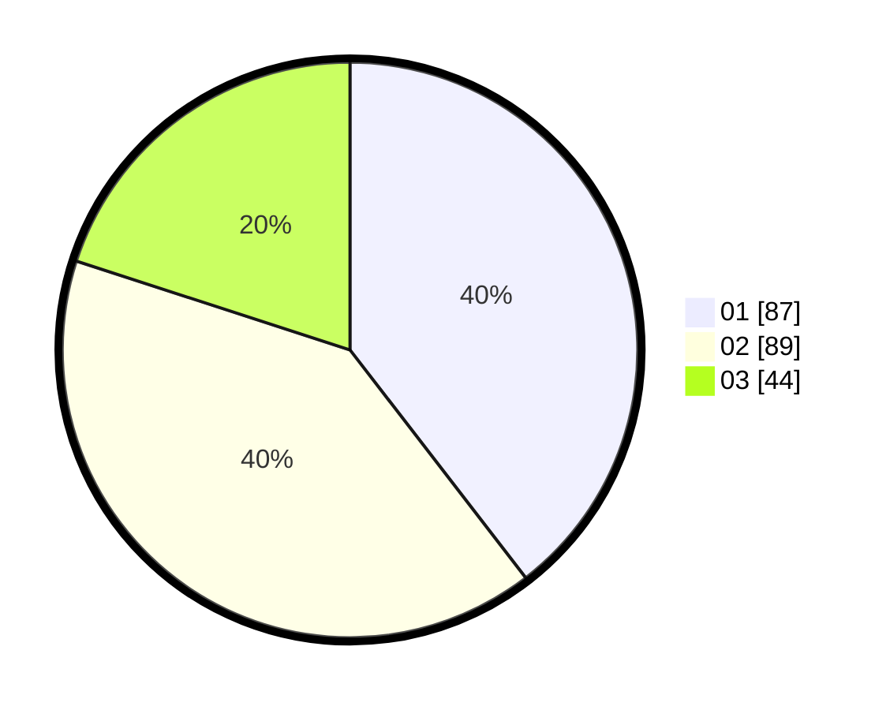

# Hasil

Hasil perolehan suara paslon dapat dilihat pada file paslon-01.txt, paslon-02.txt, dan paslon-03.txt.

Jika tidak ada, artinya data tersebut belum ada pada SIREKAP.

## Perolehan Suara

 * Paslon 01: **87**.
 * Paslon 02: **89**.
 * Paslon 03: **44**.

## Foto C Plano

https://sirekap-obj-formc.kpu.go.id/0113/pemilu/ppwp/31/74/04/10/02/3174041002092-20240214-202244--b081c05a-3c46-4ea8-85b4-81fcae522e84.jpg

https://sirekap-obj-formc.kpu.go.id/0113/pemilu/ppwp/31/74/04/10/02/3174041002092-20240214-202312--028e9929-0b84-471e-9405-1ae672f20f9c.jpg

https://sirekap-obj-formc.kpu.go.id/0113/pemilu/ppwp/31/74/04/10/02/3174041002092-20240214-202349--da7a171c-cc64-455c-a2dd-692cdfb366e0.jpg

## DATA PEMILIH TETAP

Jumlah pemilih dalam DPT: **246**.
 * L: **121**.
 * P: **125**.

## DATA PENGGUNA HAK PILIH

Jumlah pengguna hak pilih dalam DPT: **211**.
 * L: **98**.
 * P: **113**.

Jumlah pengguna hak pilih dalam DPTb: **11**.
 * L: **2**.
 * P: **9**.

Jumlah pengguna hak pilih dalam DPK: **0**.
 * L: **0**.
 * P: **0**.

Jumlah pengguna hak pilih: **222**.
 * L: **100**.
 * P: **122**.

## JUMLAH SUARA SAH DAN TIDAK SAH

JUMLAH SELURUH SUARA SAH: **220**.

JUMLAH SUARA TIDAK SAH: **2**.

JUMLAH SELURUH SUARA SAH DAN SUARA TIDAK SAH: **222**.
