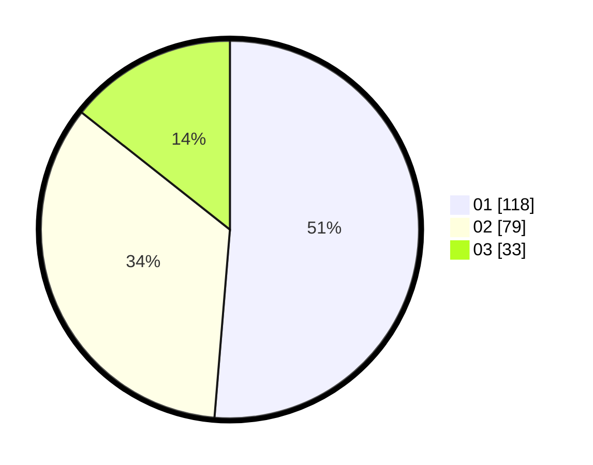

# Hasil

Hasil perolehan suara paslon dapat dilihat pada file paslon-01.txt, paslon-02.txt, dan paslon-03.txt.

Jika tidak ada, artinya data tersebut belum ada pada SIREKAP.

## Perolehan Suara

 * Paslon 01: **118**.
 * Paslon 02: **79**.
 * Paslon 03: **33**.

## Foto C Plano

https://sirekap-obj-formc.kpu.go.id/9d0e/pemilu/ppwp/31/74/04/10/02/3174041002104-20240214-184634--3aeb6f21-ec49-45b4-8a66-291a9a94d9a8.jpg

https://sirekap-obj-formc.kpu.go.id/9d0e/pemilu/ppwp/31/74/04/10/02/3174041002104-20240214-184700--8cdfff86-7236-43a5-bd24-7de2534231b1.jpg

https://sirekap-obj-formc.kpu.go.id/9d0e/pemilu/ppwp/31/74/04/10/02/3174041002104-20240214-185630--1715ec1f-8ea6-4c1a-95d9-caea0e21500b.jpg

## DATA PEMILIH TETAP

Jumlah pemilih dalam DPT: **267**.
 * L: **131**.
 * P: **136**.

## DATA PENGGUNA HAK PILIH

Jumlah pengguna hak pilih dalam DPT: **224**.
 * L: **103**.
 * P: **121**.

Jumlah pengguna hak pilih dalam DPTb: **5**.
 * L: **5**.
 * P: **0**.

Jumlah pengguna hak pilih dalam DPK: **3**.
 * L: **0**.
 * P: **3**.

Jumlah pengguna hak pilih: **232**.
 * L: **108**.
 * P: **124**.

## JUMLAH SUARA SAH DAN TIDAK SAH

JUMLAH SELURUH SUARA SAH: **230**.

JUMLAH SUARA TIDAK SAH: **2**.

JUMLAH SELURUH SUARA SAH DAN SUARA TIDAK SAH: **232**.
