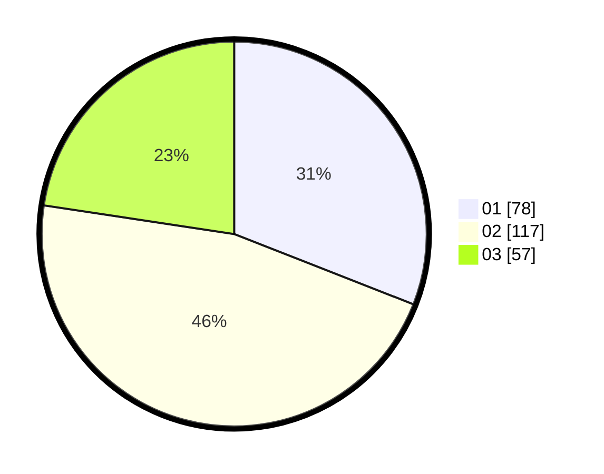

# Hasil

Hasil perolehan suara paslon dapat dilihat pada file paslon-01.txt, paslon-02.txt, dan paslon-03.txt.

Jika tidak ada, artinya data tersebut belum ada pada SIREKAP.

## Perolehan Suara

 * Paslon 01: **78**.
 * Paslon 02: **117**.
 * Paslon 03: **57**.

## Foto C Plano

https://sirekap-obj-formc.kpu.go.id/f8ad/pemilu/ppwp/31/74/04/10/02/3174041002105-20240216-013649--5dc74eca-8854-4760-8a0e-de944088af08.jpg

https://sirekap-obj-formc.kpu.go.id/f8ad/pemilu/ppwp/31/74/04/10/02/3174041002105-20240216-013654--70aae218-7621-417a-928b-42f494b20fdc.jpg

https://sirekap-obj-formc.kpu.go.id/f8ad/pemilu/ppwp/31/74/04/10/02/3174041002105-20240216-013651--6bcb30ad-78b2-4cc4-b2f2-2937838f5fb3.jpg

## DATA PEMILIH TETAP

Jumlah pemilih dalam DPT: **266**.
 * L: **140**.
 * P: **126**.

## DATA PENGGUNA HAK PILIH

Jumlah pengguna hak pilih dalam DPT: **242**.
 * L: **126**.
 * P: **116**.

Jumlah pengguna hak pilih dalam DPTb: **13**.
 * L: **6**.
 * P: **7**.

Jumlah pengguna hak pilih dalam DPK: **0**.
 * L: **0**.
 * P: **0**.

Jumlah pengguna hak pilih: **255**.
 * L: **132**.
 * P: **123**.

## JUMLAH SUARA SAH DAN TIDAK SAH

JUMLAH SELURUH SUARA SAH: **252**.

JUMLAH SUARA TIDAK SAH: **3**.

JUMLAH SELURUH SUARA SAH DAN SUARA TIDAK SAH: **255**.
