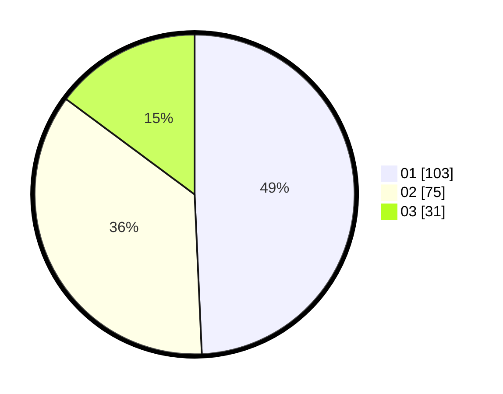

# Hasil

Hasil perolehan suara paslon dapat dilihat pada file paslon-01.txt, paslon-02.txt, dan paslon-03.txt.

Jika tidak ada, artinya data tersebut belum ada pada SIREKAP.

## Perolehan Suara

 * Paslon 01: **103**.
 * Paslon 02: **75**.
 * Paslon 03: **31**.

## Foto C Plano

https://sirekap-obj-formc.kpu.go.id/5789/pemilu/ppwp/31/74/04/10/02/3174041002107-20240214-235055--61275bb2-e360-419e-8e02-aa140de1743e.jpg

https://sirekap-obj-formc.kpu.go.id/5789/pemilu/ppwp/31/74/04/10/02/3174041002107-20240214-235131--822a26bf-c624-4c56-8636-0fb637c3415f.jpg
