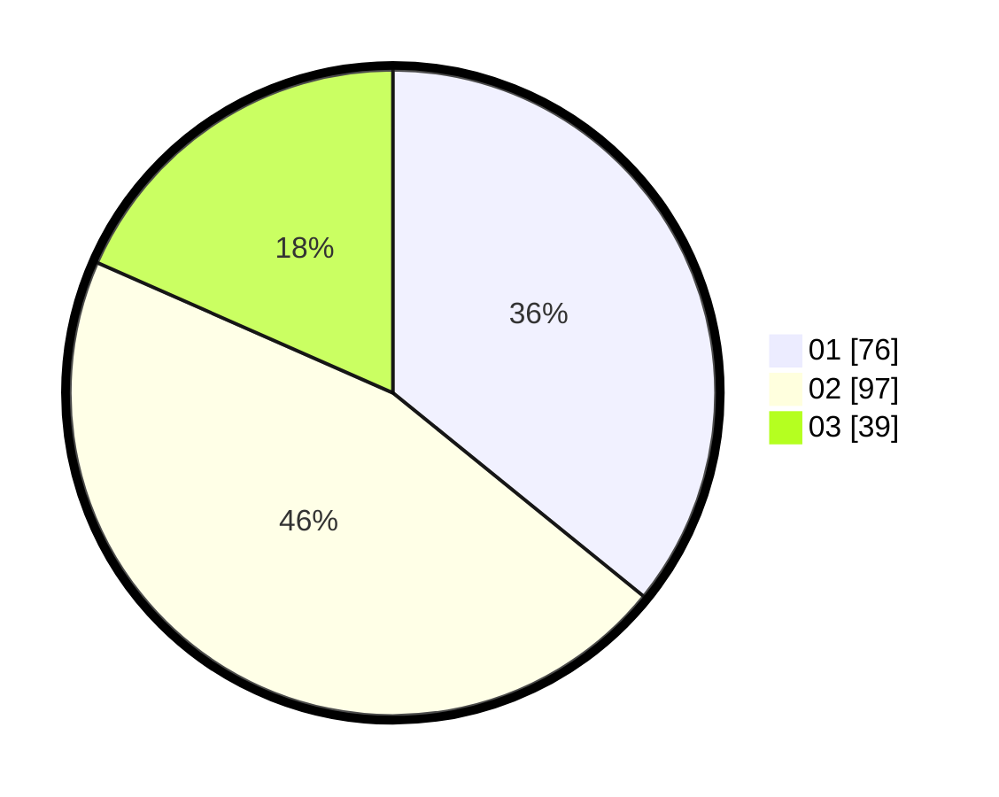

# Hasil

Hasil perolehan suara paslon dapat dilihat pada file paslon-01.txt, paslon-02.txt, dan paslon-03.txt.

Jika tidak ada, artinya data tersebut belum ada pada SIREKAP.

## Perolehan Suara

 * Paslon 01: **76**.
 * Paslon 02: **97**.
 * Paslon 03: **39**.

## Foto C Plano

https://sirekap-obj-formc.kpu.go.id/4bc0/pemilu/ppwp/31/74/04/10/02/3174041002113-20240216-013851--7d9c9805-3f77-4017-8b03-105929d1c29a.jpg

https://sirekap-obj-formc.kpu.go.id/4bc0/pemilu/ppwp/31/74/04/10/02/3174041002113-20240216-011814--0df5ca35-3441-4a58-868c-5177089cd9f3.jpg

https://sirekap-obj-formc.kpu.go.id/4bc0/pemilu/ppwp/31/74/04/10/02/3174041002113-20240216-011808--76788bf0-b4c2-47e0-8c14-eb3f351ea6b6.jpg

## DATA PEMILIH TETAP

Jumlah pemilih dalam DPT: **262**.
 * L: **125**.
 * P: **137**.

## DATA PENGGUNA HAK PILIH

Jumlah pengguna hak pilih dalam DPT: **210**.
 * L: **100**.
 * P: **110**.

Jumlah pengguna hak pilih dalam DPTb: **4**.
 * L: **3**.
 * P: **1**.

Jumlah pengguna hak pilih dalam DPK: **0**.
 * L: **0**.
 * P: **0**.

Jumlah pengguna hak pilih: **214**.
 * L: **103**.
 * P: **111**.

## JUMLAH SUARA SAH DAN TIDAK SAH

JUMLAH SELURUH SUARA SAH: **212**.

JUMLAH SUARA TIDAK SAH: **2**.

JUMLAH SELURUH SUARA SAH DAN SUARA TIDAK SAH: **214**.
