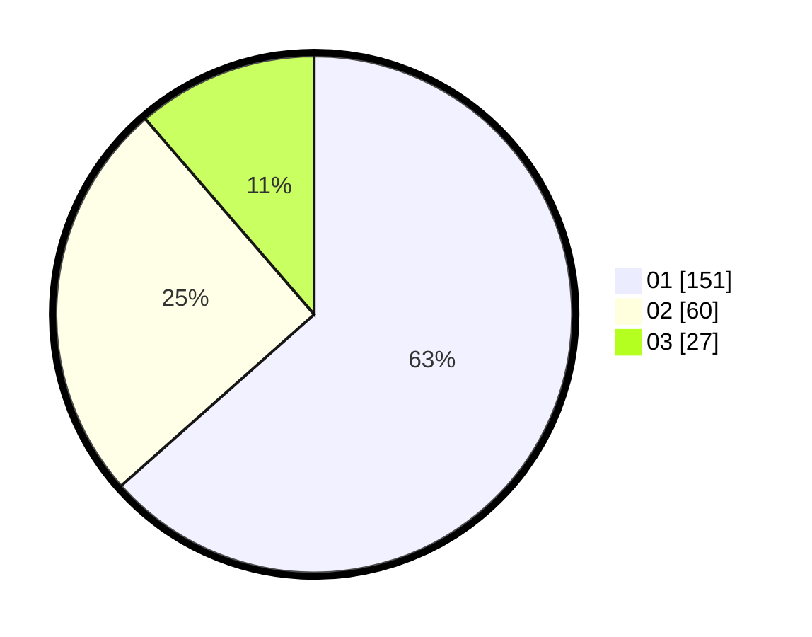

# Hasil

Hasil perolehan suara paslon dapat dilihat pada file paslon-01.txt, paslon-02.txt, dan paslon-03.txt.

Jika tidak ada, artinya data tersebut belum ada pada SIREKAP.

## Perolehan Suara

 * Paslon 01: **151**.
 * Paslon 02: **60**.
 * Paslon 03: **27**.

## Foto C Plano

https://sirekap-obj-formc.kpu.go.id/2b87/pemilu/ppwp/31/74/04/10/02/3174041002123-20240214-230411--675d59d5-1dc2-4c04-9069-fb54adebee8b.jpg

https://sirekap-obj-formc.kpu.go.id/2b87/pemilu/ppwp/31/74/04/10/02/3174041002123-20240214-223717--6164b705-a13a-4c69-82e2-4d1a3d728da8.jpg

https://sirekap-obj-formc.kpu.go.id/2b87/pemilu/ppwp/31/74/04/10/02/3174041002123-20240214-223900--4a2eeda3-ec84-4364-b91f-bc628135ab02.jpg

## DATA PEMILIH TETAP

Jumlah pemilih dalam DPT: **254**.
 * L: **129**.
 * P: **125**.

## DATA PENGGUNA HAK PILIH

Jumlah pengguna hak pilih dalam DPT: **223**.
 * L: **110**.
 * P: **113**.

Jumlah pengguna hak pilih dalam DPTb: **16**.
 * L: **6**.
 * P: **10**.

Jumlah pengguna hak pilih dalam DPK: **1**.
 * L: **0**.
 * P: **1**.

Jumlah pengguna hak pilih: **240**.
 * L: **116**.
 * P: **124**.

## JUMLAH SUARA SAH DAN TIDAK SAH

JUMLAH SELURUH SUARA SAH: **238**.

JUMLAH SUARA TIDAK SAH: **2**.

JUMLAH SELURUH SUARA SAH DAN SUARA TIDAK SAH: **240**.
