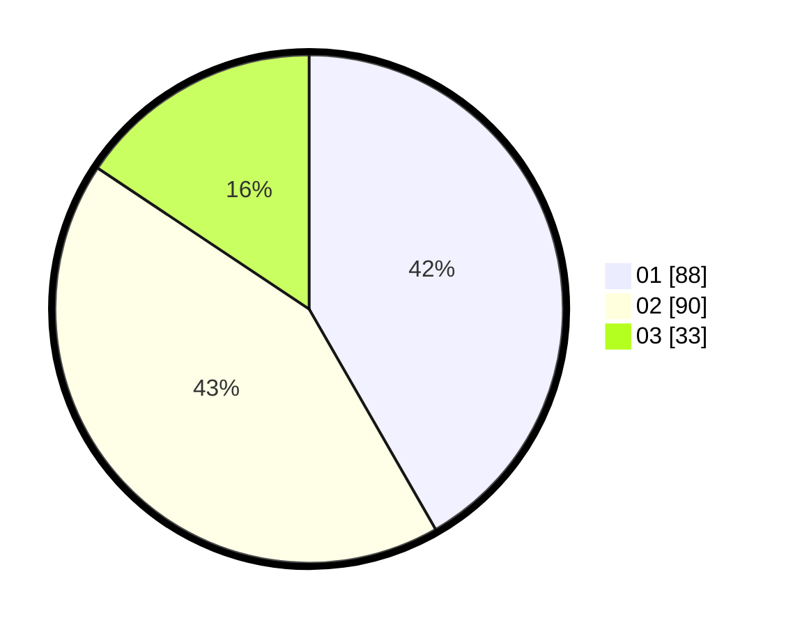

# Hasil

Hasil perolehan suara paslon dapat dilihat pada file paslon-01.txt, paslon-02.txt, dan paslon-03.txt.

Jika tidak ada, artinya data tersebut belum ada pada SIREKAP.

## Perolehan Suara

 * Paslon 01: **88**.
 * Paslon 02: **90**.
 * Paslon 03: **33**.

## Foto C Plano

https://sirekap-obj-formc.kpu.go.id/560f/pemilu/ppwp/31/74/04/10/03/3174041003005-20240214-234220--e8043ce4-bafc-4982-9f37-879d223cb3db.jpg

https://sirekap-obj-formc.kpu.go.id/560f/pemilu/ppwp/31/74/04/10/03/3174041003005-20240216-162914--76d7435b-8368-45d5-b2f3-c82ab27a36e5.jpg

https://sirekap-obj-formc.kpu.go.id/560f/pemilu/ppwp/31/74/04/10/03/3174041003005-20240216-162950--6dc3810f-8652-41ea-98dc-cf4cc4906baf.jpg

## DATA PEMILIH TETAP

Jumlah pemilih dalam DPT: **258**.
 * L: **129**.
 * P: **129**.

## DATA PENGGUNA HAK PILIH

Jumlah pengguna hak pilih dalam DPT: **198**.
 * L: **95**.
 * P: **103**.

Jumlah pengguna hak pilih dalam DPTb: **8**.
 * L: **7**.
 * P: **1**.

Jumlah pengguna hak pilih dalam DPK: **7**.
 * L: **5**.
 * P: **2**.

Jumlah pengguna hak pilih: **213**.
 * L: **107**.
 * P: **106**.

## JUMLAH SUARA SAH DAN TIDAK SAH

JUMLAH SELURUH SUARA SAH: **211**.

JUMLAH SUARA TIDAK SAH: **2**.

JUMLAH SELURUH SUARA SAH DAN SUARA TIDAK SAH: **213**.
