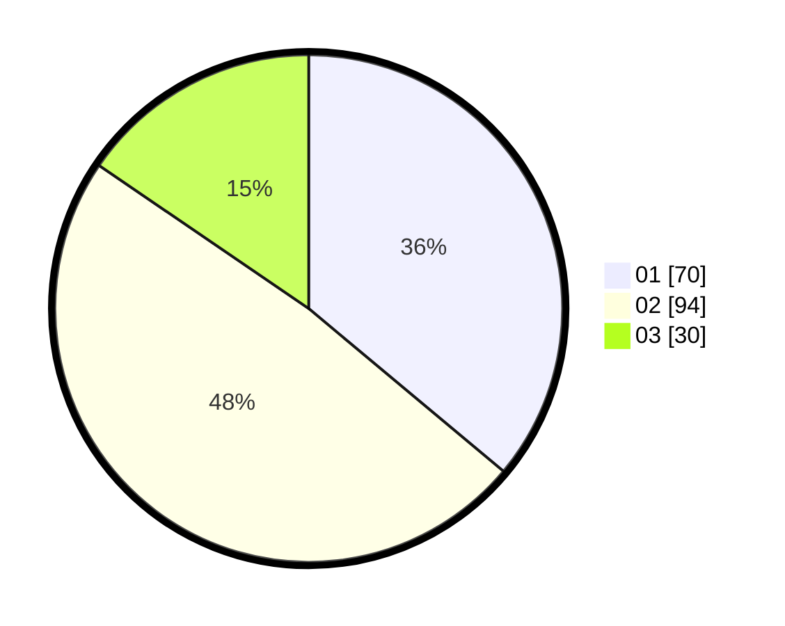

# Hasil

Hasil perolehan suara paslon dapat dilihat pada file paslon-01.txt, paslon-02.txt, dan paslon-03.txt.

Jika tidak ada, artinya data tersebut belum ada pada SIREKAP.

## Perolehan Suara

 * Paslon 01: **70**.
 * Paslon 02: **94**.
 * Paslon 03: **30**.

## Foto C Plano

https://sirekap-obj-formc.kpu.go.id/58ce/pemilu/ppwp/31/74/04/10/03/3174041003006-20240214-204251--0b4536e6-8c0e-48ff-a72f-1fab5a24cc38.jpg

https://sirekap-obj-formc.kpu.go.id/58ce/pemilu/ppwp/31/74/04/10/03/3174041003006-20240214-204811--d4192379-8e3d-41b7-8f53-69432c8f4d0f.jpg

https://sirekap-obj-formc.kpu.go.id/58ce/pemilu/ppwp/31/74/04/10/03/3174041003006-20240214-205209--54bf7e9e-4a05-4890-90c8-3615d161db5f.jpg

## DATA PEMILIH TETAP

Jumlah pemilih dalam DPT: **243**.
 * L: **121**.
 * P: **122**.

## DATA PENGGUNA HAK PILIH

Jumlah pengguna hak pilih dalam DPT: **189**.
 * L: **99**.
 * P: **90**.

Jumlah pengguna hak pilih dalam DPTb: **6**.
 * L: **6**.
 * P: **0**.

Jumlah pengguna hak pilih dalam DPK: **2**.
 * L: **1**.
 * P: **1**.

Jumlah pengguna hak pilih: **197**.
 * L: **106**.
 * P: **91**.

## JUMLAH SUARA SAH DAN TIDAK SAH

JUMLAH SELURUH SUARA SAH: **194**.

JUMLAH SUARA TIDAK SAH: **3**.

JUMLAH SELURUH SUARA SAH DAN SUARA TIDAK SAH: **197**.
