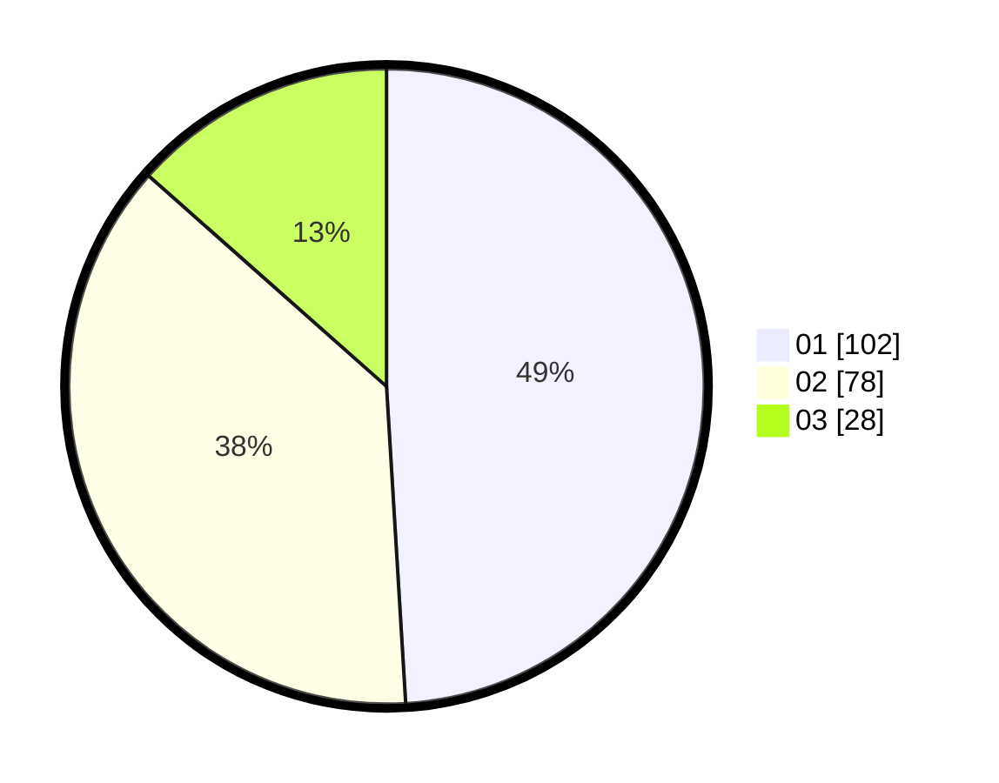

# Hasil

Hasil perolehan suara paslon dapat dilihat pada file paslon-01.txt, paslon-02.txt, dan paslon-03.txt.

Jika tidak ada, artinya data tersebut belum ada pada SIREKAP.

## Perolehan Suara

 * Paslon 01: **102**.
 * Paslon 02: **78**.
 * Paslon 03: **28**.

## Foto C Plano

https://sirekap-obj-formc.kpu.go.id/1208/pemilu/ppwp/31/74/04/10/03/3174041003007-20240214-162233--d291c487-304d-4cb5-963f-64b4d959cce5.jpg

https://sirekap-obj-formc.kpu.go.id/1208/pemilu/ppwp/31/74/04/10/03/3174041003007-20240214-175307--71d68af5-feb4-4598-b957-a1c4b9115981.jpg

https://sirekap-obj-formc.kpu.go.id/1208/pemilu/ppwp/31/74/04/10/03/3174041003007-20240214-175327--cbae27fc-f558-4a17-a38a-08a32ddb2365.jpg

## DATA PEMILIH TETAP

Jumlah pemilih dalam DPT: **239**.
 * L: **117**.
 * P: **122**.

## DATA PENGGUNA HAK PILIH

Jumlah pengguna hak pilih dalam DPT: **201**.
 * L: **102**.
 * P: **99**.

Jumlah pengguna hak pilih dalam DPTb: **5**.
 * L: **3**.
 * P: **2**.

Jumlah pengguna hak pilih dalam DPK: **4**.
 * L: **2**.
 * P: **2**.

Jumlah pengguna hak pilih: **210**.
 * L: **107**.
 * P: **103**.

## JUMLAH SUARA SAH DAN TIDAK SAH

JUMLAH SELURUH SUARA SAH: **208**.

JUMLAH SUARA TIDAK SAH: **2**.

JUMLAH SELURUH SUARA SAH DAN SUARA TIDAK SAH: **210**.
