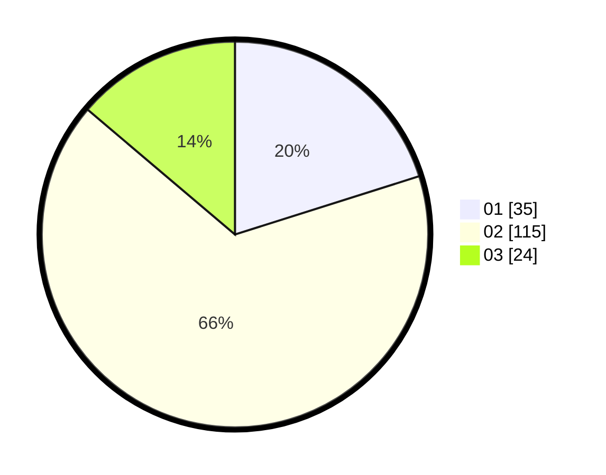

# Hasil

Hasil perolehan suara paslon dapat dilihat pada file paslon-01.txt, paslon-02.txt, dan paslon-03.txt.

Jika tidak ada, artinya data tersebut belum ada pada SIREKAP.

## Perolehan Suara

 * Paslon 01: **35**.
 * Paslon 02: **115**.
 * Paslon 03: **24**.

## Foto C Plano

https://sirekap-obj-formc.kpu.go.id/ec82/pemilu/ppwp/31/74/04/10/03/3174041003011-20240214-192848--a52d2761-05df-469c-8d7c-23adb63c8bc1.jpg

https://sirekap-obj-formc.kpu.go.id/ec82/pemilu/ppwp/31/74/04/10/03/3174041003011-20240214-192901--5cd43c07-d9c3-48db-baf6-8b028be45201.jpg

https://sirekap-obj-formc.kpu.go.id/ec82/pemilu/ppwp/31/74/04/10/03/3174041003011-20240214-192913--6e3fec0b-b363-4f13-82cc-304f5a433f8d.jpg

## DATA PEMILIH TETAP

Jumlah pemilih dalam DPT: **209**.
 * L: **97**.
 * P: **112**.

## DATA PENGGUNA HAK PILIH

Jumlah pengguna hak pilih dalam DPT: **170**.
 * L: **76**.
 * P: **94**.

Jumlah pengguna hak pilih dalam DPTb: **6**.
 * L: **3**.
 * P: **3**.

Jumlah pengguna hak pilih dalam DPK: **1**.
 * L: **1**.
 * P: **0**.

Jumlah pengguna hak pilih: **177**.
 * L: **80**.
 * P: **97**.

## JUMLAH SUARA SAH DAN TIDAK SAH

JUMLAH SELURUH SUARA SAH: **174**.

JUMLAH SUARA TIDAK SAH: **3**.

JUMLAH SELURUH SUARA SAH DAN SUARA TIDAK SAH: **177**.
