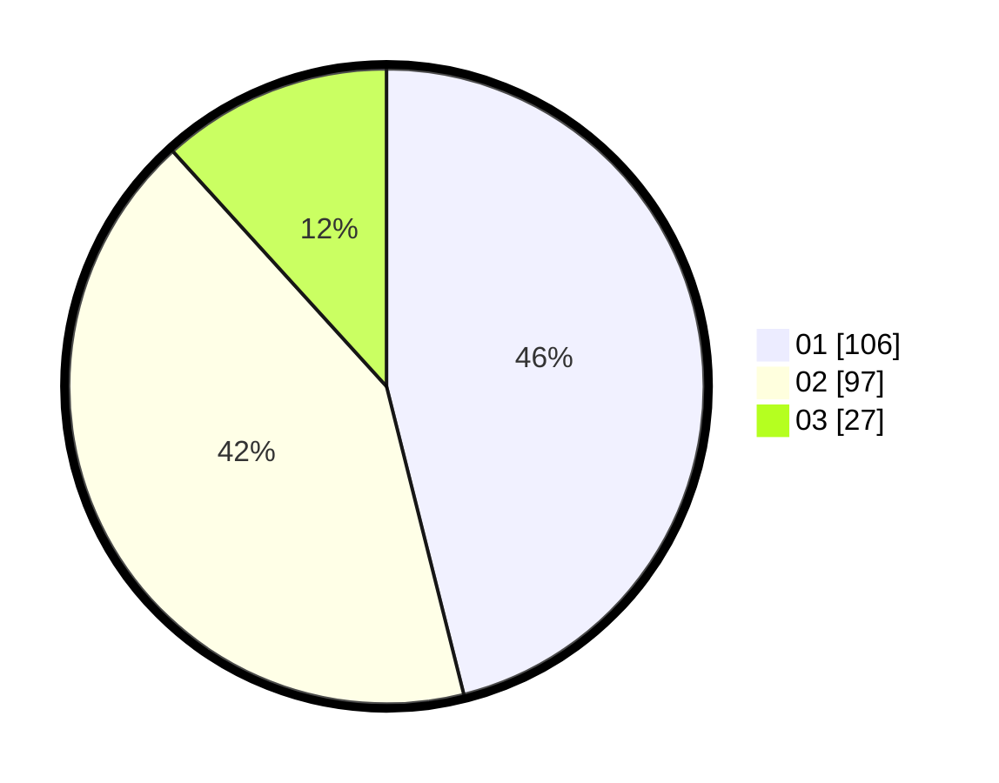

# Hasil

Hasil perolehan suara paslon dapat dilihat pada file paslon-01.txt, paslon-02.txt, dan paslon-03.txt.

Jika tidak ada, artinya data tersebut belum ada pada SIREKAP.

## Perolehan Suara

 * Paslon 01: **106**.
 * Paslon 02: **97**.
 * Paslon 03: **27**.

## Foto C Plano

https://sirekap-obj-formc.kpu.go.id/5b2f/pemilu/ppwp/31/74/04/10/03/3174041003017-20240216-162510--f26c6678-2e32-4b30-b16c-e55501222898.jpg

https://sirekap-obj-formc.kpu.go.id/5b2f/pemilu/ppwp/31/74/04/10/03/3174041003017-20240216-162512--ec370dec-a793-40a7-8bf8-b8f30dd53717.jpg

https://sirekap-obj-formc.kpu.go.id/5b2f/pemilu/ppwp/31/74/04/10/03/3174041003017-20240216-162511--23a1158b-4578-45d5-a8be-8d6ec690a102.jpg

## DATA PEMILIH TETAP

Jumlah pemilih dalam DPT: **268**.
 * L: **132**.
 * P: **136**.

## DATA PENGGUNA HAK PILIH

Jumlah pengguna hak pilih dalam DPT: **227**.
 * L: **106**.
 * P: **121**.

Jumlah pengguna hak pilih dalam DPTb: **6**.
 * L: **6**.
 * P: **0**.

Jumlah pengguna hak pilih dalam DPK: **0**.
 * L: **0**.
 * P: **0**.

Jumlah pengguna hak pilih: **233**.
 * L: **112**.
 * P: **121**.

## JUMLAH SUARA SAH DAN TIDAK SAH

JUMLAH SELURUH SUARA SAH: **230**.

JUMLAH SUARA TIDAK SAH: **3**.

JUMLAH SELURUH SUARA SAH DAN SUARA TIDAK SAH: **233**.
