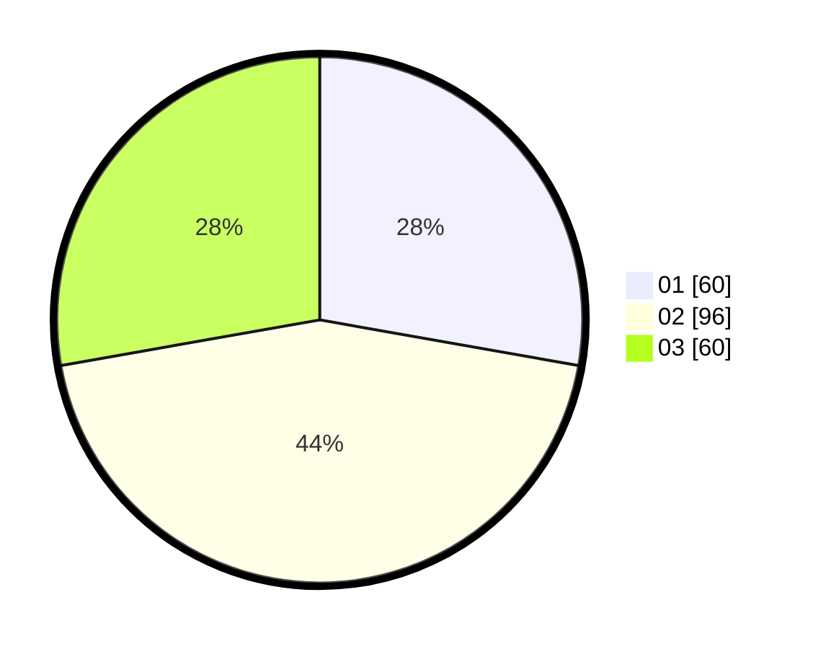

# Hasil

Hasil perolehan suara paslon dapat dilihat pada file paslon-01.txt, paslon-02.txt, dan paslon-03.txt.

Jika tidak ada, artinya data tersebut belum ada pada SIREKAP.

## Perolehan Suara

 * Paslon 01: **60**.
 * Paslon 02: **96**.
 * Paslon 03: **60**.

## Foto C Plano

https://sirekap-obj-formc.kpu.go.id/acb2/pemilu/ppwp/31/74/04/10/03/3174041003020-20240214-155653--c1d3320e-8e94-44cd-ad94-afe2c784e3e3.jpg

https://sirekap-obj-formc.kpu.go.id/acb2/pemilu/ppwp/31/74/04/10/03/3174041003020-20240214-155814--2c37430e-4a31-4e18-9366-c0a6c24cd133.jpg

https://sirekap-obj-formc.kpu.go.id/acb2/pemilu/ppwp/31/74/04/10/03/3174041003020-20240214-155552--85cdc1c4-a987-4274-bf8a-ef7f857e112d.jpg

## DATA PEMILIH TETAP

Jumlah pemilih dalam DPT: **265**.
 * L: **126**.
 * P: **139**.

## DATA PENGGUNA HAK PILIH

Jumlah pengguna hak pilih dalam DPT: **209**.
 * L: **96**.
 * P: **113**.

Jumlah pengguna hak pilih dalam DPTb: **7**.
 * L: **6**.
 * P: **1**.

Jumlah pengguna hak pilih dalam DPK: **4**.
 * L: **3**.
 * P: **1**.

Jumlah pengguna hak pilih: **220**.
 * L: **105**.
 * P: **115**.

## JUMLAH SUARA SAH DAN TIDAK SAH

JUMLAH SELURUH SUARA SAH: **216**.

JUMLAH SUARA TIDAK SAH: **4**.

JUMLAH SELURUH SUARA SAH DAN SUARA TIDAK SAH: **220**.
