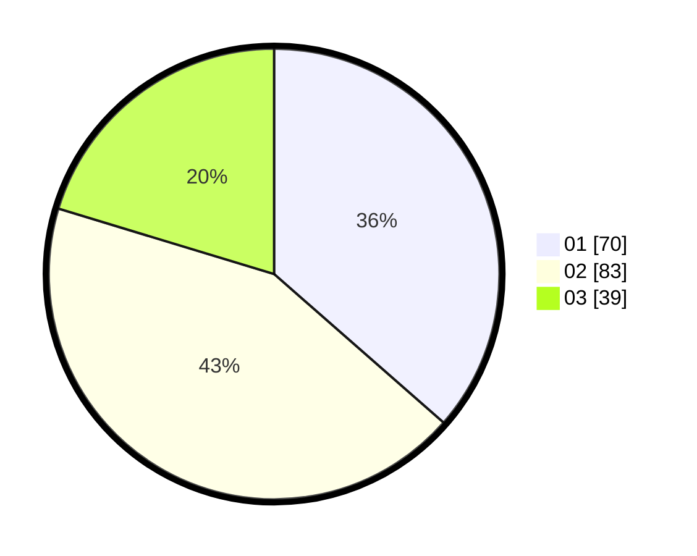

# Hasil

Hasil perolehan suara paslon dapat dilihat pada file paslon-01.txt, paslon-02.txt, dan paslon-03.txt.

Jika tidak ada, artinya data tersebut belum ada pada SIREKAP.

## Perolehan Suara

 * Paslon 01: **70**.
 * Paslon 02: **83**.
 * Paslon 03: **39**.

## Foto C Plano

https://sirekap-obj-formc.kpu.go.id/8a73/pemilu/ppwp/31/74/04/10/03/3174041003026-20240214-205710--74a8943b-ae89-450c-9048-e852adfc75da.jpg

https://sirekap-obj-formc.kpu.go.id/8a73/pemilu/ppwp/31/74/04/10/03/3174041003026-20240214-205821--db8bbe98-353b-46b0-9daf-2995d31a885e.jpg

https://sirekap-obj-formc.kpu.go.id/8a73/pemilu/ppwp/31/74/04/10/03/3174041003026-20240214-222428--9a2f36c0-fec3-469d-a5fb-cc7d905e5c1e.jpg

## DATA PEMILIH TETAP

Jumlah pemilih dalam DPT: **244**.
 * L: **114**.
 * P: **130**.

## DATA PENGGUNA HAK PILIH

Jumlah pengguna hak pilih dalam DPT: **191**.
 * L: **86**.
 * P: **105**.

Jumlah pengguna hak pilih dalam DPTb: **6**.
 * L: **2**.
 * P: **4**.

Jumlah pengguna hak pilih dalam DPK: **0**.
 * L: **0**.
 * P: **0**.

Jumlah pengguna hak pilih: **197**.
 * L: **88**.
 * P: **109**.

## JUMLAH SUARA SAH DAN TIDAK SAH

JUMLAH SELURUH SUARA SAH: **192**.

JUMLAH SUARA TIDAK SAH: **5**.

JUMLAH SELURUH SUARA SAH DAN SUARA TIDAK SAH: **197**.
