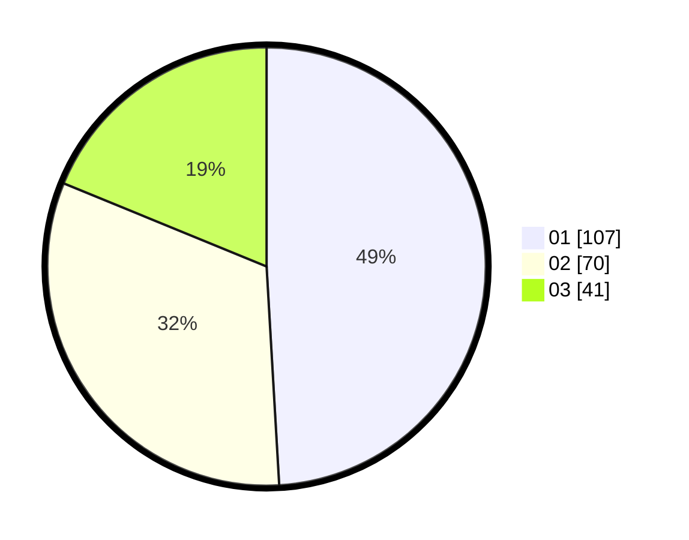

# Hasil

Hasil perolehan suara paslon dapat dilihat pada file paslon-01.txt, paslon-02.txt, dan paslon-03.txt.

Jika tidak ada, artinya data tersebut belum ada pada SIREKAP.

## Perolehan Suara

 * Paslon 01: **107**.
 * Paslon 02: **70**.
 * Paslon 03: **41**.

## Foto C Plano

https://sirekap-obj-formc.kpu.go.id/b96a/pemilu/ppwp/31/74/04/10/03/3174041003028-20240214-175442--33dacc86-e1a8-4a83-a761-364f41aac4bf.jpg

https://sirekap-obj-formc.kpu.go.id/b96a/pemilu/ppwp/31/74/04/10/03/3174041003028-20240214-202009--b34a817c-f4da-442b-aabd-23a092ca12ca.jpg

https://sirekap-obj-formc.kpu.go.id/b96a/pemilu/ppwp/31/74/04/10/03/3174041003028-20240214-162235--ed96edcf-0015-4cdc-9068-bb02fde3a2d4.jpg

## DATA PEMILIH TETAP

Jumlah pemilih dalam DPT: **221**.
 * L: **105**.
 * P: **116**.

## DATA PENGGUNA HAK PILIH

Jumlah pengguna hak pilih dalam DPT: **211**.
 * L: **100**.
 * P: **111**.

Jumlah pengguna hak pilih dalam DPTb: **8**.
 * L: **3**.
 * P: **5**.

Jumlah pengguna hak pilih dalam DPK: **2**.
 * L: **2**.
 * P: **0**.

Jumlah pengguna hak pilih: **221**.
 * L: **105**.
 * P: **116**.

## JUMLAH SUARA SAH DAN TIDAK SAH

JUMLAH SELURUH SUARA SAH: **218**.

JUMLAH SUARA TIDAK SAH: **3**.

JUMLAH SELURUH SUARA SAH DAN SUARA TIDAK SAH: **221**.
