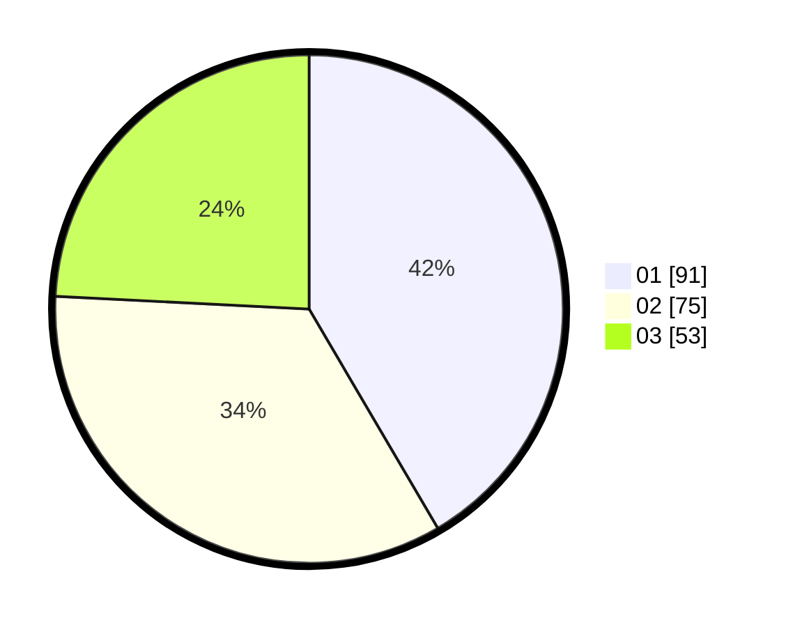

# Hasil

Hasil perolehan suara paslon dapat dilihat pada file paslon-01.txt, paslon-02.txt, dan paslon-03.txt.

Jika tidak ada, artinya data tersebut belum ada pada SIREKAP.

## Perolehan Suara

 * Paslon 01: **91**.
 * Paslon 02: **75**.
 * Paslon 03: **53**.

## Foto C Plano

https://sirekap-obj-formc.kpu.go.id/dd62/pemilu/ppwp/31/74/04/10/03/3174041003029-20240214-201702--22ed9dbf-df22-40a8-a188-0948fee1035f.jpg

https://sirekap-obj-formc.kpu.go.id/dd62/pemilu/ppwp/31/74/04/10/03/3174041003029-20240214-201935--e8d014d3-da60-4c4a-bd0d-5cd97c3facdd.jpg

https://sirekap-obj-formc.kpu.go.id/dd62/pemilu/ppwp/31/74/04/10/03/3174041003029-20240214-201939--abd9523c-6aa2-43fe-984c-b52a0a2e3713.jpg

## DATA PEMILIH TETAP

Jumlah pemilih dalam DPT: **241**.
 * L: **102**.
 * P: **139**.

## DATA PENGGUNA HAK PILIH

Jumlah pengguna hak pilih dalam DPT: **202**.
 * L: **84**.
 * P: **118**.

Jumlah pengguna hak pilih dalam DPTb: **15**.
 * L: **5**.
 * P: **10**.

Jumlah pengguna hak pilih dalam DPK: **4**.
 * L: **0**.
 * P: **4**.

Jumlah pengguna hak pilih: **221**.
 * L: **89**.
 * P: **132**.

## JUMLAH SUARA SAH DAN TIDAK SAH

JUMLAH SELURUH SUARA SAH: **219**.

JUMLAH SUARA TIDAK SAH: **2**.

JUMLAH SELURUH SUARA SAH DAN SUARA TIDAK SAH: **221**.
