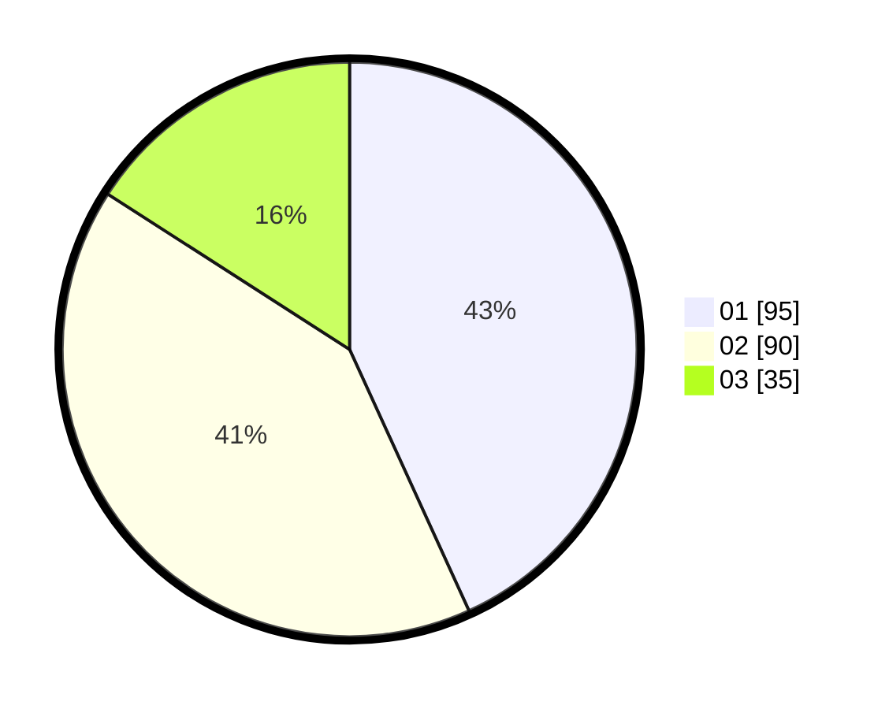

# Hasil

Hasil perolehan suara paslon dapat dilihat pada file paslon-01.txt, paslon-02.txt, dan paslon-03.txt.

Jika tidak ada, artinya data tersebut belum ada pada SIREKAP.

## Perolehan Suara

 * Paslon 01: **95**.
 * Paslon 02: **90**.
 * Paslon 03: **35**.

## Foto C Plano

https://sirekap-obj-formc.kpu.go.id/d345/pemilu/ppwp/31/74/04/10/03/3174041003032-20240214-223420--cbe840de-d2ce-4dd2-a1fb-6a9dbe38250d.jpg

https://sirekap-obj-formc.kpu.go.id/d345/pemilu/ppwp/31/74/04/10/03/3174041003032-20240214-223442--faaefb3c-1bcd-48ee-9303-3db3c7449afc.jpg

https://sirekap-obj-formc.kpu.go.id/d345/pemilu/ppwp/31/74/04/10/03/3174041003032-20240214-223431--5ea856bd-823b-49fa-87ca-7b2d86c5748a.jpg

## DATA PEMILIH TETAP

Jumlah pemilih dalam DPT: **264**.
 * L: **131**.
 * P: **133**.

## DATA PENGGUNA HAK PILIH

Jumlah pengguna hak pilih dalam DPT: **209**.
 * L: **99**.
 * P: **110**.

Jumlah pengguna hak pilih dalam DPTb: **13**.
 * L: **6**.
 * P: **7**.

Jumlah pengguna hak pilih dalam DPK: **1**.
 * L: **0**.
 * P: **1**.

Jumlah pengguna hak pilih: **223**.
 * L: **105**.
 * P: **118**.

## JUMLAH SUARA SAH DAN TIDAK SAH

JUMLAH SELURUH SUARA SAH: **220**.

JUMLAH SUARA TIDAK SAH: **3**.

JUMLAH SELURUH SUARA SAH DAN SUARA TIDAK SAH: **223**.
