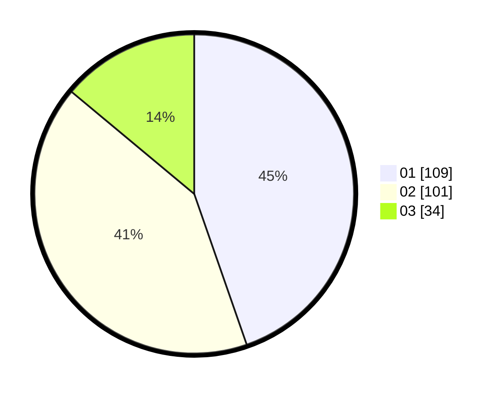

# Hasil

Hasil perolehan suara paslon dapat dilihat pada file paslon-01.txt, paslon-02.txt, dan paslon-03.txt.

Jika tidak ada, artinya data tersebut belum ada pada SIREKAP.

## Perolehan Suara

 * Paslon 01: **109**.
 * Paslon 02: **101**.
 * Paslon 03: **34**.

## Foto C Plano

https://sirekap-obj-formc.kpu.go.id/8aa5/pemilu/ppwp/31/74/04/10/03/3174041003033-20240214-184605--e5934e5c-710c-4267-bc1f-f4084af2c678.jpg

https://sirekap-obj-formc.kpu.go.id/8aa5/pemilu/ppwp/31/74/04/10/03/3174041003033-20240214-184609--a02e243c-20dc-459a-8a7d-886ed453de6b.jpg

https://sirekap-obj-formc.kpu.go.id/8aa5/pemilu/ppwp/31/74/04/10/03/3174041003033-20240214-184614--be747c60-9c2e-4f3e-bdd1-4251f221a281.jpg

## DATA PEMILIH TETAP

Jumlah pemilih dalam DPT: **268**.
 * L: **138**.
 * P: **130**.

## DATA PENGGUNA HAK PILIH

Jumlah pengguna hak pilih dalam DPT: **211**.
 * L: **102**.
 * P: **109**.

Jumlah pengguna hak pilih dalam DPTb: **28**.
 * L: **6**.
 * P: **22**.

Jumlah pengguna hak pilih dalam DPK: **8**.
 * L: **5**.
 * P: **3**.

Jumlah pengguna hak pilih: **247**.
 * L: **113**.
 * P: **134**.

## JUMLAH SUARA SAH DAN TIDAK SAH

JUMLAH SELURUH SUARA SAH: **244**.

JUMLAH SUARA TIDAK SAH: **3**.

JUMLAH SELURUH SUARA SAH DAN SUARA TIDAK SAH: **247**.
