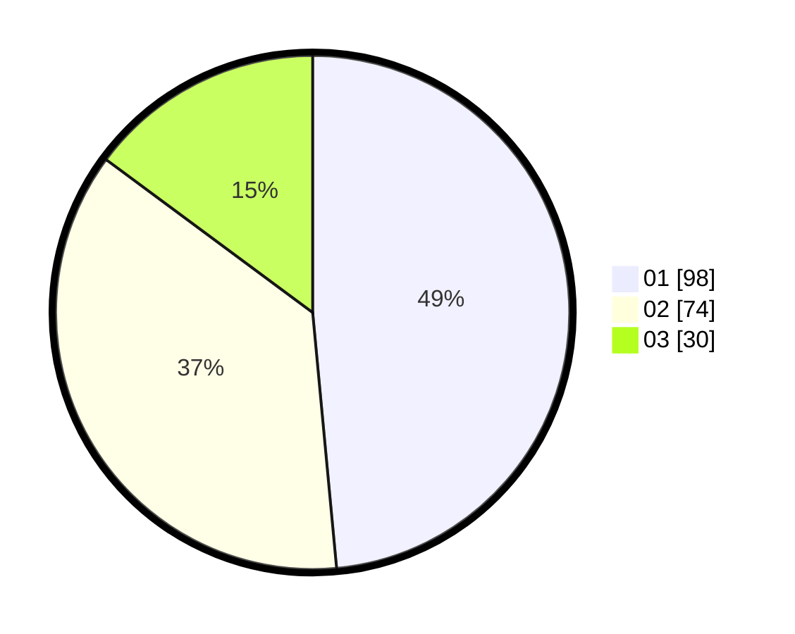

# Hasil

Hasil perolehan suara paslon dapat dilihat pada file paslon-01.txt, paslon-02.txt, dan paslon-03.txt.

Jika tidak ada, artinya data tersebut belum ada pada SIREKAP.

## Perolehan Suara

 * Paslon 01: **98**.
 * Paslon 02: **74**.
 * Paslon 03: **30**.

## Foto C Plano

https://sirekap-obj-formc.kpu.go.id/5b1d/pemilu/ppwp/31/74/04/10/03/3174041003041-20240214-223031--453bd7a4-a2c6-4b32-9828-2db2363b91c3.jpg

https://sirekap-obj-formc.kpu.go.id/5b1d/pemilu/ppwp/31/74/04/10/03/3174041003041-20240214-222925--4189b3ce-8636-4659-bc21-2ae572d4133f.jpg

https://sirekap-obj-formc.kpu.go.id/5b1d/pemilu/ppwp/31/74/04/10/03/3174041003041-20240214-223510--65e49e10-7857-4055-be82-a3407287eba4.jpg

## DATA PEMILIH TETAP

Jumlah pemilih dalam DPT: **238**.
 * L: **114**.
 * P: **124**.

## DATA PENGGUNA HAK PILIH

Jumlah pengguna hak pilih dalam DPT: **188**.
 * L: **93**.
 * P: **95**.

Jumlah pengguna hak pilih dalam DPTb: **7**.
 * L: **7**.
 * P: **0**.

Jumlah pengguna hak pilih dalam DPK: **9**.
 * L: **4**.
 * P: **5**.

Jumlah pengguna hak pilih: **204**.
 * L: **104**.
 * P: **100**.

## JUMLAH SUARA SAH DAN TIDAK SAH

JUMLAH SELURUH SUARA SAH: **202**.

JUMLAH SUARA TIDAK SAH: **2**.

JUMLAH SELURUH SUARA SAH DAN SUARA TIDAK SAH: **204**.
