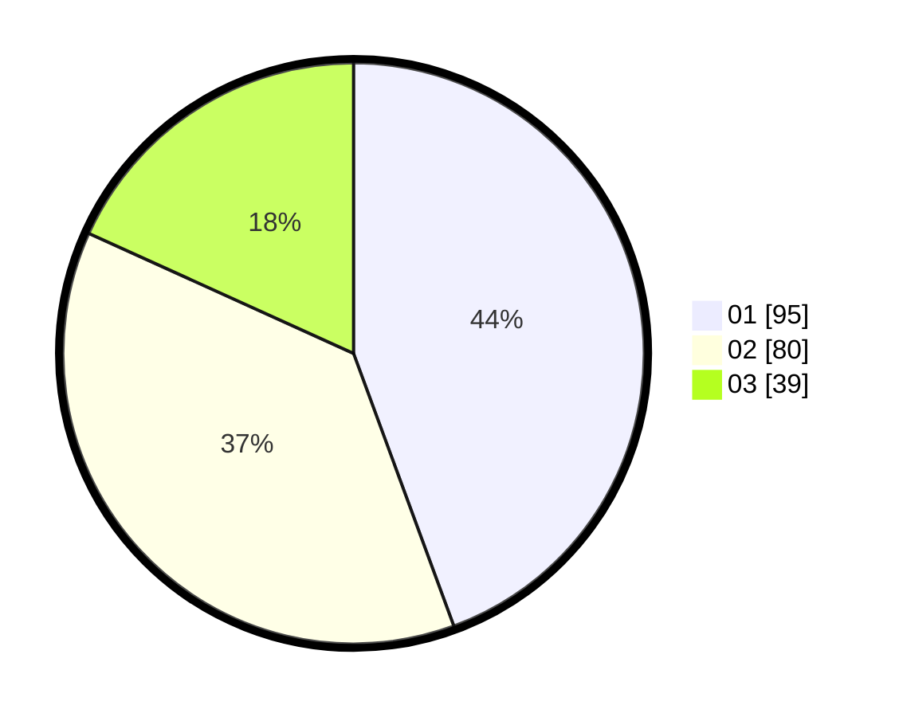

# Hasil

Hasil perolehan suara paslon dapat dilihat pada file paslon-01.txt, paslon-02.txt, dan paslon-03.txt.

Jika tidak ada, artinya data tersebut belum ada pada SIREKAP.

## Perolehan Suara

 * Paslon 01: **95**.
 * Paslon 02: **80**.
 * Paslon 03: **39**.

## Foto C Plano

https://sirekap-obj-formc.kpu.go.id/a169/pemilu/ppwp/31/74/04/10/03/3174041003049-20240215-224115--d4cc14bb-0912-438a-a8d7-d90cc24e177e.jpg

https://sirekap-obj-formc.kpu.go.id/a169/pemilu/ppwp/31/74/04/10/03/3174041003049-20240215-224117--6817a201-50ff-4502-a50a-15ce0be1eff0.jpg

https://sirekap-obj-formc.kpu.go.id/a169/pemilu/ppwp/31/74/04/10/03/3174041003049-20240215-224117--b305d0f6-3486-452e-9339-449a8a630721.jpg

## DATA PEMILIH TETAP

Jumlah pemilih dalam DPT: **265**.
 * L: **121**.
 * P: **144**.

## DATA PENGGUNA HAK PILIH

Jumlah pengguna hak pilih dalam DPT: **212**.
 * L: **97**.
 * P: **115**.

Jumlah pengguna hak pilih dalam DPTb: **4**.
 * L: **2**.
 * P: **2**.

Jumlah pengguna hak pilih dalam DPK: **0**.
 * L: **0**.
 * P: **0**.

Jumlah pengguna hak pilih: **216**.
 * L: **99**.
 * P: **117**.

## JUMLAH SUARA SAH DAN TIDAK SAH

JUMLAH SELURUH SUARA SAH: **214**.

JUMLAH SUARA TIDAK SAH: **2**.

JUMLAH SELURUH SUARA SAH DAN SUARA TIDAK SAH: **216**.
