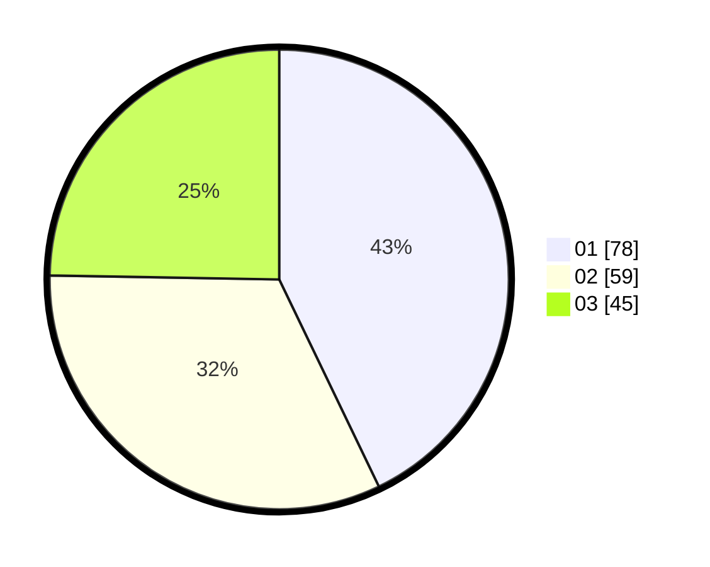

# Hasil

Hasil perolehan suara paslon dapat dilihat pada file paslon-01.txt, paslon-02.txt, dan paslon-03.txt.

Jika tidak ada, artinya data tersebut belum ada pada SIREKAP.

## Perolehan Suara

 * Paslon 01: **78**.
 * Paslon 02: **59**.
 * Paslon 03: **45**.

## Foto C Plano

https://sirekap-obj-formc.kpu.go.id/5e85/pemilu/ppwp/31/74/04/10/03/3174041003054-20240216-012035--3b4f0a34-5da3-4100-a9bb-f90cf1d3aa75.jpg

https://sirekap-obj-formc.kpu.go.id/5e85/pemilu/ppwp/31/74/04/10/03/3174041003054-20240216-011526--bd6cdf9b-0179-4fc7-a5e7-72472ecd20cf.jpg

https://sirekap-obj-formc.kpu.go.id/5e85/pemilu/ppwp/31/74/04/10/03/3174041003054-20240216-011525--14f98f7d-db35-4946-9320-f721a9367c5c.jpg

## DATA PEMILIH TETAP

Jumlah pemilih dalam DPT: **247**.
 * L: **117**.
 * P: **130**.

## DATA PENGGUNA HAK PILIH

Jumlah pengguna hak pilih dalam DPT: **176**.
 * L: **79**.
 * P: **97**.

Jumlah pengguna hak pilih dalam DPTb: **7**.
 * L: **3**.
 * P: **4**.

Jumlah pengguna hak pilih dalam DPK: **1**.
 * L: **0**.
 * P: **1**.

Jumlah pengguna hak pilih: **184**.
 * L: **82**.
 * P: **102**.

## JUMLAH SUARA SAH DAN TIDAK SAH

JUMLAH SELURUH SUARA SAH: **182**.

JUMLAH SUARA TIDAK SAH: **2**.

JUMLAH SELURUH SUARA SAH DAN SUARA TIDAK SAH: **184**.
