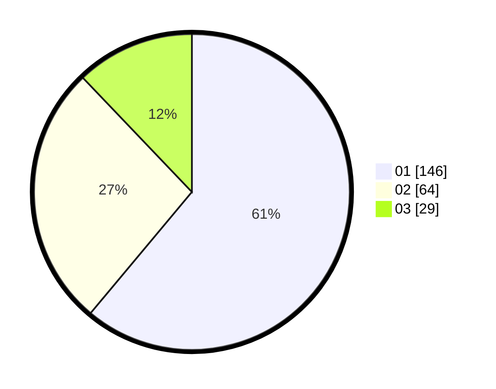

# Hasil

Hasil perolehan suara paslon dapat dilihat pada file paslon-01.txt, paslon-02.txt, dan paslon-03.txt.

Jika tidak ada, artinya data tersebut belum ada pada SIREKAP.

## Perolehan Suara

 * Paslon 01: **146**.
 * Paslon 02: **64**.
 * Paslon 03: **29**.

## Foto C Plano

https://sirekap-obj-formc.kpu.go.id/f062/pemilu/ppwp/31/74/04/10/03/3174041003058-20240214-195537--c52f6e6f-d8bb-4473-ad65-0eba20ad7cd0.jpg

https://sirekap-obj-formc.kpu.go.id/f062/pemilu/ppwp/31/74/04/10/03/3174041003058-20240214-195713--63c5f725-43e8-4e44-8dbc-7c7ba7ce1164.jpg

https://sirekap-obj-formc.kpu.go.id/f062/pemilu/ppwp/31/74/04/10/03/3174041003058-20240214-211347--a90f7d69-90f1-41f1-a332-5ffb08eafab5.jpg

## DATA PEMILIH TETAP

Jumlah pemilih dalam DPT: **287**.
 * L: **135**.
 * P: **152**.

## DATA PENGGUNA HAK PILIH

Jumlah pengguna hak pilih dalam DPT: **232**.
 * L: **107**.
 * P: **125**.

Jumlah pengguna hak pilih dalam DPTb: **4**.
 * L: **3**.
 * P: **1**.

Jumlah pengguna hak pilih dalam DPK: **4**.
 * L: **3**.
 * P: **1**.

Jumlah pengguna hak pilih: **240**.
 * L: **113**.
 * P: **127**.

## JUMLAH SUARA SAH DAN TIDAK SAH

JUMLAH SELURUH SUARA SAH: **239**.

JUMLAH SUARA TIDAK SAH: **1**.

JUMLAH SELURUH SUARA SAH DAN SUARA TIDAK SAH: **240**.
