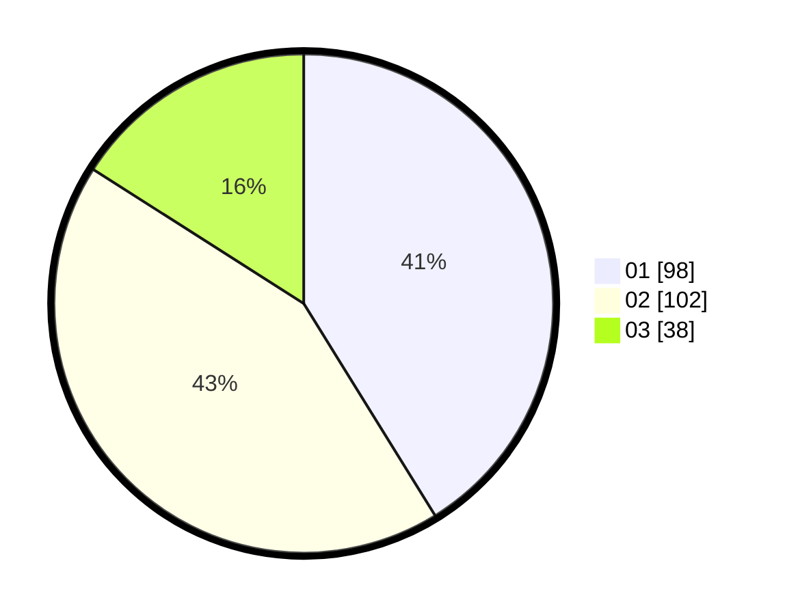

# Hasil

Hasil perolehan suara paslon dapat dilihat pada file paslon-01.txt, paslon-02.txt, dan paslon-03.txt.

Jika tidak ada, artinya data tersebut belum ada pada SIREKAP.

## Perolehan Suara

 * Paslon 01: **98**.
 * Paslon 02: **102**.
 * Paslon 03: **38**.

## Foto C Plano

https://sirekap-obj-formc.kpu.go.id/62db/pemilu/ppwp/31/74/04/10/04/3174041004004-20240214-194144--dc0e8ec5-69cf-4c38-98ac-bcbfd89bdf79.jpg

https://sirekap-obj-formc.kpu.go.id/62db/pemilu/ppwp/31/74/04/10/04/3174041004004-20240214-194342--48c17a11-f2a1-4f15-9fc4-0d249d3ef388.jpg

https://sirekap-obj-formc.kpu.go.id/62db/pemilu/ppwp/31/74/04/10/04/3174041004004-20240214-184515--c41e3764-37d7-4b95-9b9b-596e0b54d4d9.jpg

## DATA PEMILIH TETAP

Jumlah pemilih dalam DPT: **278**.
 * L: **139**.
 * P: **139**.

## DATA PENGGUNA HAK PILIH

Jumlah pengguna hak pilih dalam DPT: **229**.
 * L: **114**.
 * P: **115**.

Jumlah pengguna hak pilih dalam DPTb: **9**.
 * L: **2**.
 * P: **7**.

Jumlah pengguna hak pilih dalam DPK: **0**.
 * L: **0**.
 * P: **0**.

Jumlah pengguna hak pilih: **238**.
 * L: **116**.
 * P: **122**.

## JUMLAH SUARA SAH DAN TIDAK SAH

JUMLAH SELURUH SUARA SAH: **238**.

JUMLAH SUARA TIDAK SAH: **0**.

JUMLAH SELURUH SUARA SAH DAN SUARA TIDAK SAH: **238**.
