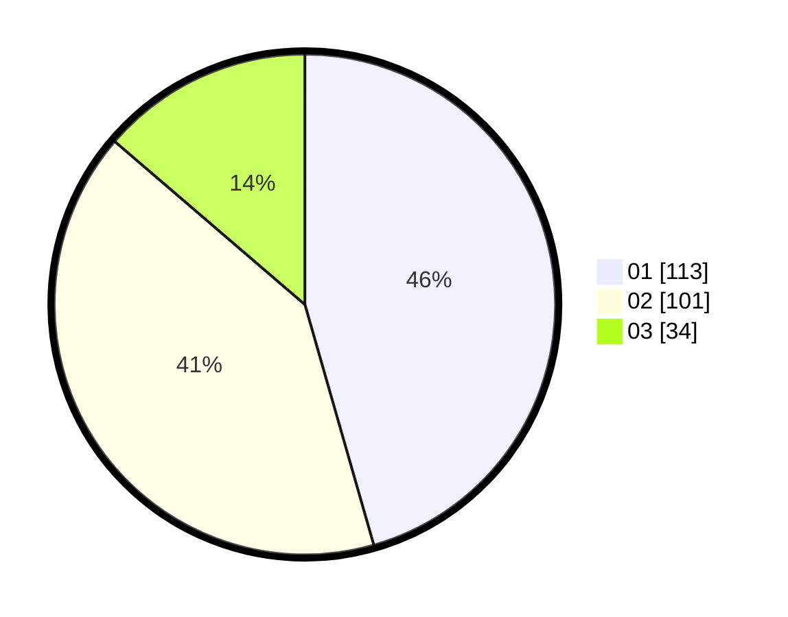

# Hasil

Hasil perolehan suara paslon dapat dilihat pada file paslon-01.txt, paslon-02.txt, dan paslon-03.txt.

Jika tidak ada, artinya data tersebut belum ada pada SIREKAP.

## Perolehan Suara

 * Paslon 01: **113**.
 * Paslon 02: **101**.
 * Paslon 03: **34**.

## Foto C Plano

https://sirekap-obj-formc.kpu.go.id/5f0c/pemilu/ppwp/31/74/04/10/04/3174041004007-20240216-121547--4e4d5d1f-efcd-42e6-bd67-a28c9f72e384.jpg

https://sirekap-obj-formc.kpu.go.id/5f0c/pemilu/ppwp/31/74/04/10/04/3174041004007-20240216-122311--d11ffb96-6d48-4a85-bd16-d6921c1bb263.jpg

https://sirekap-obj-formc.kpu.go.id/5f0c/pemilu/ppwp/31/74/04/10/04/3174041004007-20240216-122944--a15bee8a-2cef-42ab-8d5f-a98d544a9e41.jpg

## DATA PEMILIH TETAP

Jumlah pemilih dalam DPT: **284**.
 * L: **130**.
 * P: **154**.

## DATA PENGGUNA HAK PILIH

Jumlah pengguna hak pilih dalam DPT: **242**.
 * L: **112**.
 * P: **130**.

Jumlah pengguna hak pilih dalam DPTb: **8**.
 * L: **2**.
 * P: **6**.

Jumlah pengguna hak pilih dalam DPK: **1**.
 * L: **0**.
 * P: **1**.

Jumlah pengguna hak pilih: **251**.
 * L: **114**.
 * P: **137**.

## JUMLAH SUARA SAH DAN TIDAK SAH

JUMLAH SELURUH SUARA SAH: **248**.

JUMLAH SUARA TIDAK SAH: **3**.

JUMLAH SELURUH SUARA SAH DAN SUARA TIDAK SAH: **251**.
