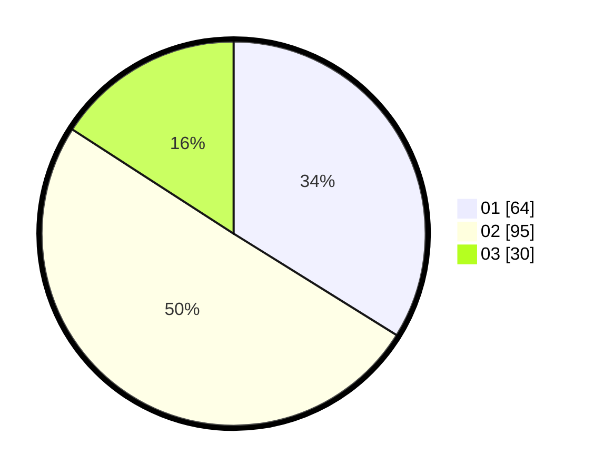

# Hasil

Hasil perolehan suara paslon dapat dilihat pada file paslon-01.txt, paslon-02.txt, dan paslon-03.txt.

Jika tidak ada, artinya data tersebut belum ada pada SIREKAP.

## Perolehan Suara

 * Paslon 01: **64**.
 * Paslon 02: **95**.
 * Paslon 03: **30**.

## Foto C Plano

https://sirekap-obj-formc.kpu.go.id/1120/pemilu/ppwp/31/74/04/10/04/3174041004016-20240215-005023--5edc41a2-12de-4706-b1aa-7f96adb00597.jpg

https://sirekap-obj-formc.kpu.go.id/1120/pemilu/ppwp/31/74/04/10/04/3174041004016-20240215-005128--68a221e6-faac-466e-876a-5e342ac72149.jpg

https://sirekap-obj-formc.kpu.go.id/1120/pemilu/ppwp/31/74/04/10/04/3174041004016-20240215-005231--704baad8-fbbc-4f8a-b575-e147d73217b7.jpg
