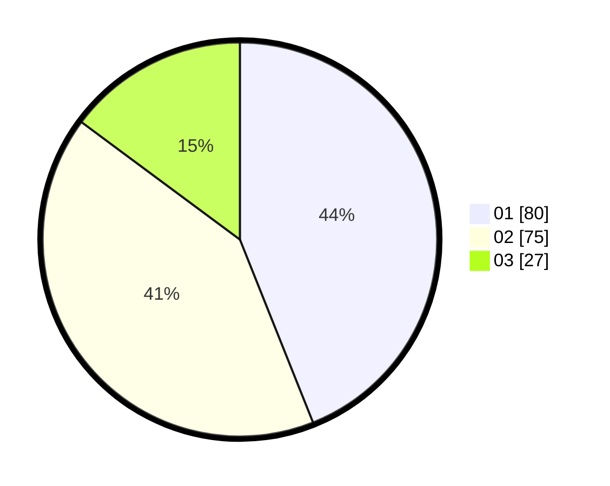

# Hasil

Hasil perolehan suara paslon dapat dilihat pada file paslon-01.txt, paslon-02.txt, dan paslon-03.txt.

Jika tidak ada, artinya data tersebut belum ada pada SIREKAP.

## Perolehan Suara

 * Paslon 01: **80**.
 * Paslon 02: **75**.
 * Paslon 03: **27**.

## Foto C Plano

https://sirekap-obj-formc.kpu.go.id/20de/pemilu/ppwp/31/74/04/10/04/3174041004018-20240215-022318--03d9f2a6-e33a-4b0a-88d0-4a15c6db6504.jpg

https://sirekap-obj-formc.kpu.go.id/20de/pemilu/ppwp/31/74/04/10/04/3174041004018-20240215-022513--45526364-5807-45b6-b222-666e4d93771e.jpg

https://sirekap-obj-formc.kpu.go.id/20de/pemilu/ppwp/31/74/04/10/04/3174041004018-20240215-022715--b2a56119-5e74-465a-acca-b4c7ae1632c4.jpg

## DATA PEMILIH TETAP

Jumlah pemilih dalam DPT: **238**.
 * L: **119**.
 * P: **119**.

## DATA PENGGUNA HAK PILIH

Jumlah pengguna hak pilih dalam DPT: **185**.
 * L: **89**.
 * P: **96**.

Jumlah pengguna hak pilih dalam DPTb: **0**.
 * L: **0**.
 * P: **0**.

Jumlah pengguna hak pilih dalam DPK: **0**.
 * L: **0**.
 * P: **0**.

Jumlah pengguna hak pilih: **185**.
 * L: **89**.
 * P: **96**.

## JUMLAH SUARA SAH DAN TIDAK SAH

JUMLAH SELURUH SUARA SAH: **182**.

JUMLAH SUARA TIDAK SAH: **3**.

JUMLAH SELURUH SUARA SAH DAN SUARA TIDAK SAH: **185**.
