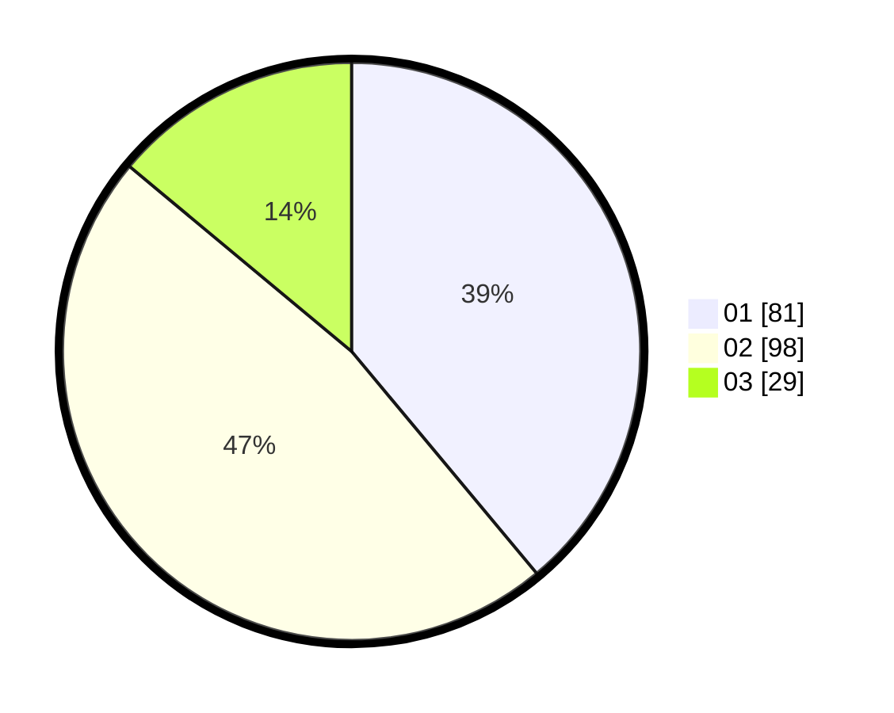

# Hasil

Hasil perolehan suara paslon dapat dilihat pada file paslon-01.txt, paslon-02.txt, dan paslon-03.txt.

Jika tidak ada, artinya data tersebut belum ada pada SIREKAP.

## Perolehan Suara

 * Paslon 01: **81**.
 * Paslon 02: **98**.
 * Paslon 03: **29**.

## Foto C Plano

https://sirekap-obj-formc.kpu.go.id/60e6/pemilu/ppwp/31/74/04/10/04/3174041004024-20240214-155541--b229c254-7805-40bc-91a4-4dd636265599.jpg

https://sirekap-obj-formc.kpu.go.id/60e6/pemilu/ppwp/31/74/04/10/04/3174041004024-20240214-160144--c929e31c-ca7f-4de3-a30e-4718acf7cf57.jpg

https://sirekap-obj-formc.kpu.go.id/60e6/pemilu/ppwp/31/74/04/10/04/3174041004024-20240214-185601--a999fc01-321e-44f0-9cb6-b457245ad2fb.jpg

## DATA PEMILIH TETAP

Jumlah pemilih dalam DPT: **255**.
 * L: **119**.
 * P: **136**.

## DATA PENGGUNA HAK PILIH

Jumlah pengguna hak pilih dalam DPT: **202**.
 * L: **92**.
 * P: **110**.

Jumlah pengguna hak pilih dalam DPTb: **6**.
 * L: **0**.
 * P: **6**.

Jumlah pengguna hak pilih dalam DPK: **0**.
 * L: **0**.
 * P: **0**.

Jumlah pengguna hak pilih: **208**.
 * L: **92**.
 * P: **116**.

## JUMLAH SUARA SAH DAN TIDAK SAH

JUMLAH SELURUH SUARA SAH: **208**.

JUMLAH SUARA TIDAK SAH: **0**.

JUMLAH SELURUH SUARA SAH DAN SUARA TIDAK SAH: **208**.
