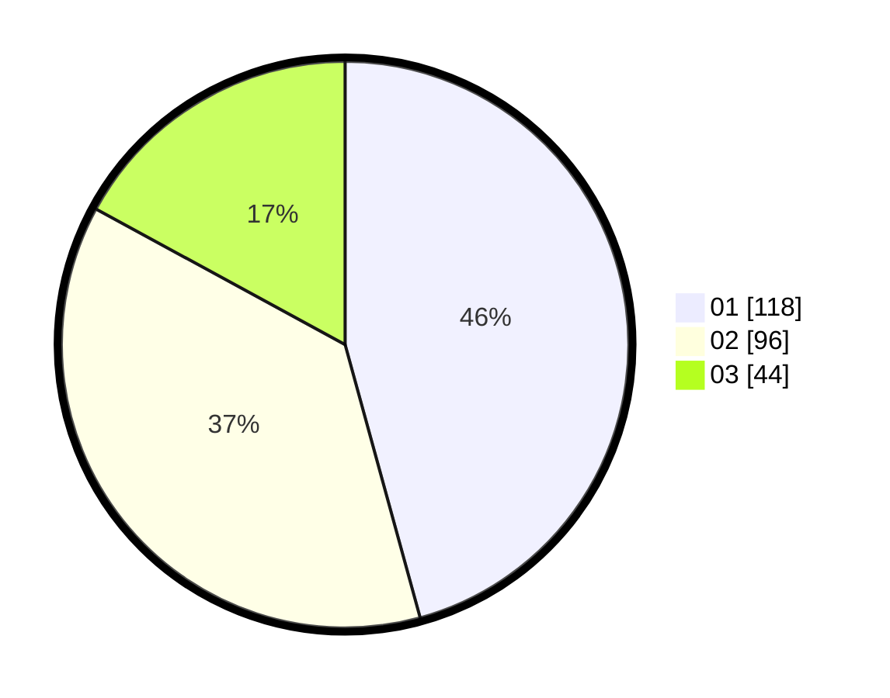

# Hasil

Hasil perolehan suara paslon dapat dilihat pada file paslon-01.txt, paslon-02.txt, dan paslon-03.txt.

Jika tidak ada, artinya data tersebut belum ada pada SIREKAP.

## Perolehan Suara

 * Paslon 01: **118**.
 * Paslon 02: **96**.
 * Paslon 03: **44**.

## Foto C Plano

https://sirekap-obj-formc.kpu.go.id/c431/pemilu/ppwp/31/74/04/10/04/3174041004038-20240214-184434--4b8bf3a3-3e67-4e88-9afa-ece0d45f9579.jpg

https://sirekap-obj-formc.kpu.go.id/c431/pemilu/ppwp/31/74/04/10/04/3174041004038-20240214-185344--c2205968-e7c8-44ec-ac0e-bbac7eb33951.jpg

https://sirekap-obj-formc.kpu.go.id/c431/pemilu/ppwp/31/74/04/10/04/3174041004038-20240214-215112--8cf464ea-f2c8-4df0-bdbc-5320631f9b9c.jpg

## DATA PEMILIH TETAP

Jumlah pemilih dalam DPT: **297**.
 * L: **144**.
 * P: **153**.

## DATA PENGGUNA HAK PILIH

Jumlah pengguna hak pilih dalam DPT: **234**.
 * L: **109**.
 * P: **125**.

Jumlah pengguna hak pilih dalam DPTb: **25**.
 * L: **10**.
 * P: **15**.

Jumlah pengguna hak pilih dalam DPK: **1**.
 * L: **1**.
 * P: **0**.

Jumlah pengguna hak pilih: **260**.
 * L: **120**.
 * P: **140**.

## JUMLAH SUARA SAH DAN TIDAK SAH

JUMLAH SELURUH SUARA SAH: **258**.

JUMLAH SUARA TIDAK SAH: **2**.

JUMLAH SELURUH SUARA SAH DAN SUARA TIDAK SAH: **260**.
