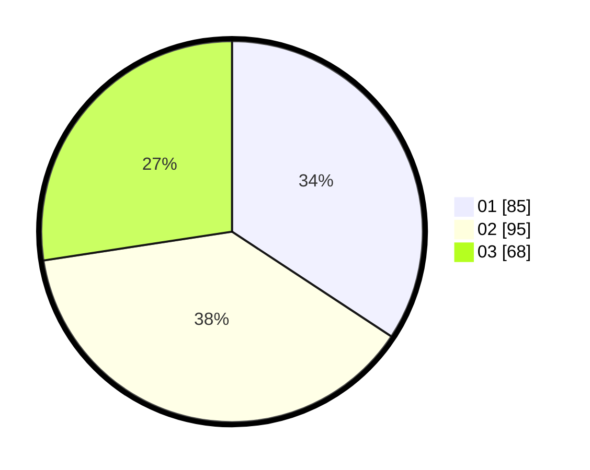

# Hasil

Hasil perolehan suara paslon dapat dilihat pada file paslon-01.txt, paslon-02.txt, dan paslon-03.txt.

Jika tidak ada, artinya data tersebut belum ada pada SIREKAP.

## Perolehan Suara

 * Paslon 01: **85**.
 * Paslon 02: **95**.
 * Paslon 03: **68**.

## Foto C Plano

https://sirekap-obj-formc.kpu.go.id/03a9/pemilu/ppwp/31/74/04/10/04/3174041004041-20240217-102428--7ce12ba7-37c5-4135-8fcb-56e9215c4954.jpg

https://sirekap-obj-formc.kpu.go.id/03a9/pemilu/ppwp/31/74/04/10/04/3174041004041-20240217-103655--1461a040-c85b-4328-8729-787d8f39a477.jpg

https://sirekap-obj-formc.kpu.go.id/03a9/pemilu/ppwp/31/74/04/10/04/3174041004041-20240217-103135--d0d1cb45-86b7-4548-8059-5ae311d83292.jpg

## DATA PEMILIH TETAP

Jumlah pemilih dalam DPT: **293**.
 * L: **144**.
 * P: **149**.

## DATA PENGGUNA HAK PILIH

Jumlah pengguna hak pilih dalam DPT: **242**.
 * L: **116**.
 * P: **126**.

Jumlah pengguna hak pilih dalam DPTb: **6**.
 * L: **2**.
 * P: **4**.

Jumlah pengguna hak pilih dalam DPK: **3**.
 * L: **2**.
 * P: **1**.

Jumlah pengguna hak pilih: **251**.
 * L: **120**.
 * P: **131**.

## JUMLAH SUARA SAH DAN TIDAK SAH

JUMLAH SELURUH SUARA SAH: **248**.

JUMLAH SUARA TIDAK SAH: **3**.

JUMLAH SELURUH SUARA SAH DAN SUARA TIDAK SAH: **251**.
