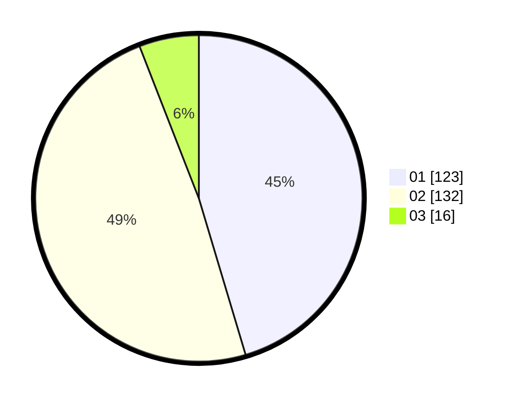

# Hasil

Hasil perolehan suara paslon dapat dilihat pada file paslon-01.txt, paslon-02.txt, dan paslon-03.txt.

Jika tidak ada, artinya data tersebut belum ada pada SIREKAP.

## Perolehan Suara

 * Paslon 01: **123**.
 * Paslon 02: **132**.
 * Paslon 03: **16**.

## Foto C Plano

https://sirekap-obj-formc.kpu.go.id/c178/pemilu/ppwp/31/74/04/10/04/3174041004046-20240214-191055--2c8b4672-64f3-4620-96b2-18de7fab15fe.jpg

https://sirekap-obj-formc.kpu.go.id/c178/pemilu/ppwp/31/74/04/10/04/3174041004046-20240214-192945--97189a05-fadf-4084-8a8e-2ea723fb6c17.jpg

https://sirekap-obj-formc.kpu.go.id/c178/pemilu/ppwp/31/74/04/10/04/3174041004046-20240214-193126--307a5bdb-1f95-41f9-8416-440e859c14a2.jpg

## DATA PEMILIH TETAP

Jumlah pemilih dalam DPT: **298**.
 * L: **152**.
 * P: **146**.

## DATA PENGGUNA HAK PILIH

Jumlah pengguna hak pilih dalam DPT: **253**.
 * L: **128**.
 * P: **125**.

Jumlah pengguna hak pilih dalam DPTb: **18**.
 * L: **6**.
 * P: **12**.

Jumlah pengguna hak pilih dalam DPK: **2**.
 * L: **2**.
 * P: **0**.

Jumlah pengguna hak pilih: **273**.
 * L: **136**.
 * P: **137**.

## JUMLAH SUARA SAH DAN TIDAK SAH

JUMLAH SELURUH SUARA SAH: **271**.

JUMLAH SUARA TIDAK SAH: **2**.

JUMLAH SELURUH SUARA SAH DAN SUARA TIDAK SAH: **273**.
