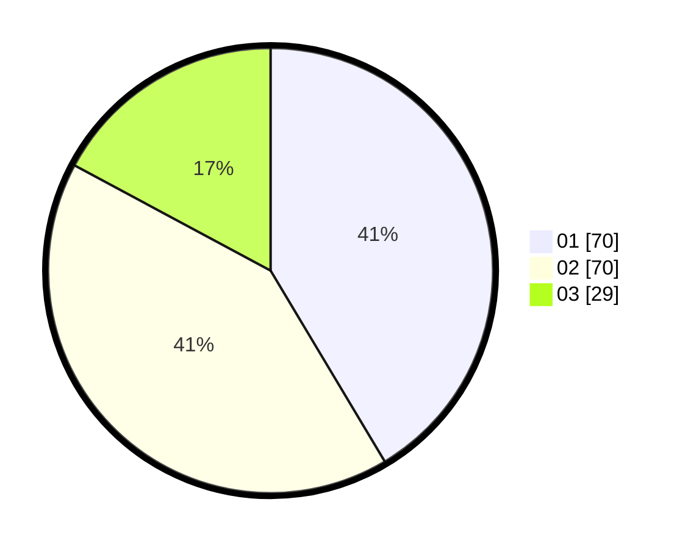

# Hasil

Hasil perolehan suara paslon dapat dilihat pada file paslon-01.txt, paslon-02.txt, dan paslon-03.txt.

Jika tidak ada, artinya data tersebut belum ada pada SIREKAP.

## Perolehan Suara

 * Paslon 01: **70**.
 * Paslon 02: **70**.
 * Paslon 03: **29**.

## Foto C Plano

https://sirekap-obj-formc.kpu.go.id/c29a/pemilu/ppwp/31/74/04/10/04/3174041004048-20240214-191928--a3d561d3-5520-4ce6-a940-50e0b8e231ff.jpg

https://sirekap-obj-formc.kpu.go.id/c29a/pemilu/ppwp/31/74/04/10/04/3174041004048-20240214-191251--c67e8e7e-2183-448e-9803-2c4c8bb063fb.jpg

https://sirekap-obj-formc.kpu.go.id/c29a/pemilu/ppwp/31/74/04/10/04/3174041004048-20240214-191303--e36e2d10-d9e4-443b-8ca3-d610714fd450.jpg

## DATA PEMILIH TETAP

Jumlah pemilih dalam DPT: **206**.
 * L: **98**.
 * P: **108**.

## DATA PENGGUNA HAK PILIH

Jumlah pengguna hak pilih dalam DPT: **153**.
 * L: **73**.
 * P: **80**.

Jumlah pengguna hak pilih dalam DPTb: **17**.
 * L: **7**.
 * P: **10**.

Jumlah pengguna hak pilih dalam DPK: **2**.
 * L: **1**.
 * P: **1**.

Jumlah pengguna hak pilih: **172**.
 * L: **81**.
 * P: **91**.

## JUMLAH SUARA SAH DAN TIDAK SAH

JUMLAH SELURUH SUARA SAH: **169**.

JUMLAH SUARA TIDAK SAH: **3**.

JUMLAH SELURUH SUARA SAH DAN SUARA TIDAK SAH: **172**.
