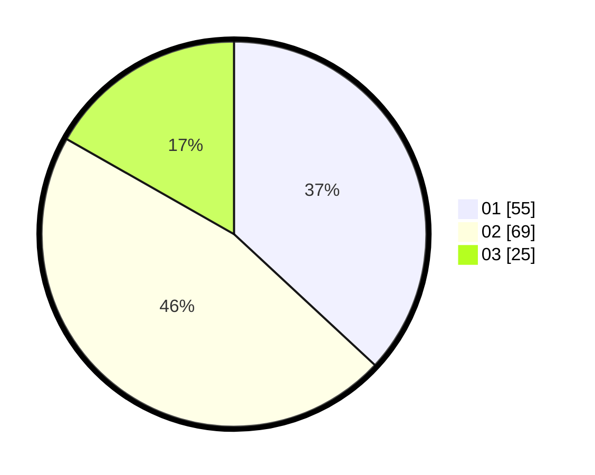

# Hasil

Hasil perolehan suara paslon dapat dilihat pada file paslon-01.txt, paslon-02.txt, dan paslon-03.txt.

Jika tidak ada, artinya data tersebut belum ada pada SIREKAP.

## Perolehan Suara

 * Paslon 01: **55**.
 * Paslon 02: **69**.
 * Paslon 03: **25**.

## Foto C Plano

https://sirekap-obj-formc.kpu.go.id/05ec/pemilu/ppwp/31/74/04/10/04/3174041004051-20240214-155257--50171889-4385-47bf-bc93-83267c83c95a.jpg

https://sirekap-obj-formc.kpu.go.id/05ec/pemilu/ppwp/31/74/04/10/04/3174041004051-20240214-155346--eb5c5550-cfdd-4759-bfa6-71d8973301a9.jpg

https://sirekap-obj-formc.kpu.go.id/05ec/pemilu/ppwp/31/74/04/10/04/3174041004051-20240214-155444--3e404a8a-852d-4b1d-bd1d-0e5c7d5fcd2e.jpg

## DATA PEMILIH TETAP

Jumlah pemilih dalam DPT: **212**.
 * L: **97**.
 * P: **115**.

## DATA PENGGUNA HAK PILIH

Jumlah pengguna hak pilih dalam DPT: **154**.
 * L: **63**.
 * P: **91**.

Jumlah pengguna hak pilih dalam DPTb: **0**.
 * L: **0**.
 * P: **0**.

Jumlah pengguna hak pilih dalam DPK: **1**.
 * L: **1**.
 * P: **0**.

Jumlah pengguna hak pilih: **155**.
 * L: **64**.
 * P: **91**.

## JUMLAH SUARA SAH DAN TIDAK SAH

JUMLAH SELURUH SUARA SAH: **149**.

JUMLAH SUARA TIDAK SAH: **6**.

JUMLAH SELURUH SUARA SAH DAN SUARA TIDAK SAH: **155**.
