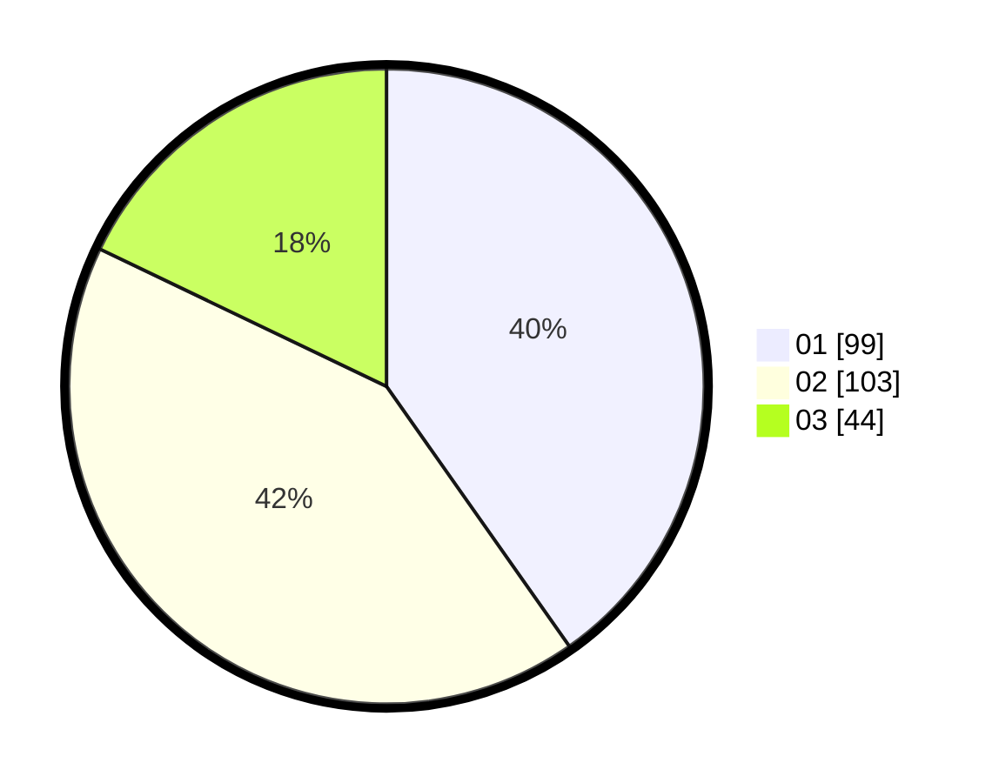

# Hasil

Hasil perolehan suara paslon dapat dilihat pada file paslon-01.txt, paslon-02.txt, dan paslon-03.txt.

Jika tidak ada, artinya data tersebut belum ada pada SIREKAP.

## Perolehan Suara

 * Paslon 01: **99**.
 * Paslon 02: **103**.
 * Paslon 03: **44**.

## Foto C Plano

https://sirekap-obj-formc.kpu.go.id/7dac/pemilu/ppwp/31/74/04/10/04/3174041004065-20240214-223811--1948e8e0-42ce-4a58-98b6-2c82132aafea.jpg

https://sirekap-obj-formc.kpu.go.id/7dac/pemilu/ppwp/31/74/04/10/04/3174041004065-20240214-223602--f3ded78f-d3b7-4f40-be8b-55f6a89f7cba.jpg

https://sirekap-obj-formc.kpu.go.id/7dac/pemilu/ppwp/31/74/04/10/04/3174041004065-20240214-223713--a8fb6e1a-bf00-45f4-8522-40f3cef21018.jpg

## DATA PEMILIH TETAP

Jumlah pemilih dalam DPT: **294**.
 * L: **155**.
 * P: **139**.

## DATA PENGGUNA HAK PILIH

Jumlah pengguna hak pilih dalam DPT: **245**.
 * L: **124**.
 * P: **121**.

Jumlah pengguna hak pilih dalam DPTb: **1**.
 * L: **0**.
 * P: **1**.

Jumlah pengguna hak pilih dalam DPK: **2**.
 * L: **1**.
 * P: **1**.

Jumlah pengguna hak pilih: **248**.
 * L: **125**.
 * P: **127**.

## JUMLAH SUARA SAH DAN TIDAK SAH

JUMLAH SELURUH SUARA SAH: **246**.

JUMLAH SUARA TIDAK SAH: **2**.

JUMLAH SELURUH SUARA SAH DAN SUARA TIDAK SAH: **248**.
